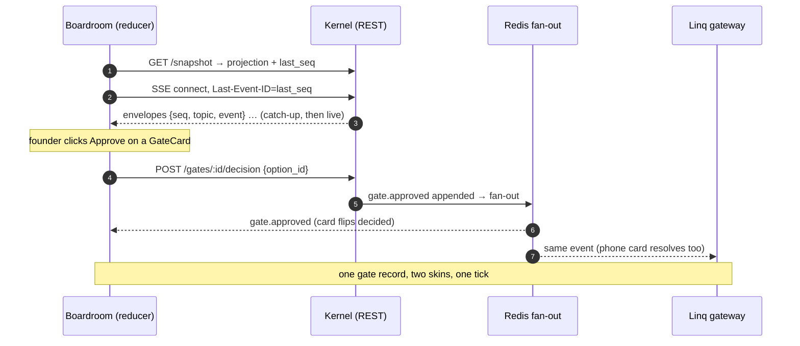

# 09 — Boardroom UI: The Control Room

The Boardroom is `apps/boardroom` — Next.js 15 (App Router), React 19, Tailwind, one SSE
connection to the kernel. It is a **projection of the event log rendered as an isometric office
floor plan**, plus the founder's approval and control surfaces. Two rules govern every pixel:

1. **If a UI element has no event behind it, it is fake and must be deleted**
   ([`03-event-bus.md`](03-event-bus.md)).
2. **A judge should understand the entire system in four seconds of looking at it**
   ([north star](../00-START-HERE/01-north-star.md)) — pixel-art isometric, 16×16 sprites,
   readable at a glance, borrowed deliberately from `simit` / sim-francisco.

The phone (Linq) is the founder's *interface*; the Boardroom is the *glass*. Everything decidable
here is also decidable there — one gate record either way, reconciled within one SSE tick.

---

## 1. Information architecture

```
/                                 venture switcher (one founder, N ventures)
/v/:ventureId                     ┐
  ├── (default) FLOORPLAN         │ the four-second view. Rooms, sprites, status ring
  ├── /stream                     │ live activity stream (filterable event feed)
  ├── /inbox                      │ approval inbox — every pending/recent gate
  ├── /money                      │ budget & runway panel
  ├── /artifacts                  │ artifact browser + version diffs
  ├── /escalations                │ escalation view (the ladder, live)
  ├── /gate/:gateId               │ single gate detail — deep-link target of every Linq card
  ├── /dept/:deptId               │ department room detail (roster, envelope, work orders)
  └── /settings                   │ autonomy dial, caps, quiet hours, connections
GLOBAL, all routes:
  header: venture name · five-segment ring · runway · autonomy badge · KILL SWITCH
  right drawer: EVIDENCE DRAWER (slides over any route, never navigates away)
```

Layout: floorplan is the permanent center stage on desktop; stream docks right, money docks
bottom. On the phone-sized web view every panel is a full-screen route — but the phone story is
Linq, so mobile web is **POST-MVP** polish, not a target.

| Zone | Route(s) | MVP? |
|---|---|---|
| Floorplan + header + kill switch | `/v/:id` | **MVP** |
| Activity stream | `/stream` (docked) | **MVP** |
| Approval inbox + gate detail | `/inbox`, `/gate/:id` | **MVP** |
| Evidence drawer | global | **MVP** |
| Budget & runway panel | `/money` (docked) | **MVP** |
| Artifact browser | `/artifacts` | **MVP** (diffs **POST-MVP**, see §8) |
| Escalation view | `/escalations` | **MVP** — the Terac beat needs it on screen |
| Department detail | `/dept/:id` | **POST-MVP** (the room tooltip covers the demo) |
| Settings | `/settings` | **POST-MVP** (onboarding set them; changing them is rare) |

---

## 2. State sources — SSE topics

One `EventSource` per venture: `GET /api/v/:ventureId/sse?topics=…`. The kernel fans out from
Redis; every message is an envelope `{seq, ts, topic, event}` where `event` is a row from the
[event taxonomy](03-event-bus.md) — the Boardroom defines **no private event types**.

| SSE topic | Underlying events | Feeds |
|---|---|---|
| `rooms` | `dept.*`, `agent.started/finished` | Floorplan room states, sprite positions |
| `handoffs` | `dept.work_order_issued`, `artifact.*` | Sprite walk animations, artifact browser |
| `gates` | `gate.*` | Inbox, gate detail, floorplan speech bubbles |
| `money` | `money.*` | Budget panel, header runway, revenue ring segment |
| `escalations` | `escalation.raised/climbed/resolved`, `terac.*` | Escalation view, amber rooms |
| `humans` | `human.*` | Consent badges, interview markers in stream |
| `build` | `build.*` | Build room detail, deploy toasts |
| `sales` | `sales.*`, `support.*` | Pipeline ticker in stream, deal toasts |
| `venture` | `venture.*` | Header ring, kill/pause banners, autonomy badge |

Client state: a single reducer over the envelope stream (the UI is literally a second projection
of the same log the kernel projects). On mount: `GET /api/v/:id/snapshot` returns the current
projection + `last_seq`; SSE resumes from `Last-Event-ID = last_seq`. A gap (`seq` skip) triggers
snapshot re-fetch — never patch-guessing. Writes are plain REST (`POST /gates/:id/decision`,
`POST /ventures/:id/kill`, `POST /depts/:id/freeze`) and the UI **waits for the event to come
back over SSE** rather than optimistically mutating: latency is one tick, honesty is total.



---

## 3. The floorplan **MVP**

The four-second view. An isometric office, one room per department, rendered from
`DepartmentManifest` metadata (room position, size, sprite set) so a D13-generated department
gets a room with zero UI code — the finale depends on this.

```
 ┌────────────────────────────────────────────────────────────────────┐
 │  ZEROTH-DENTAL          ●●●○○  runway $41.20   AUTONOMOUS   [KILL] │
 ├────────────────────────────────────────────────────────────────────┤
 │   ┌─────────┐ ┌─────────┐ ┌─────────┐   ┌─────────┐ ┌──────────┐   │
 │   │D01 In   │ │D02 OH   │ │D03 Mkt  │   │D08 Strat│ │D09 Leads │   │
 │   │  ▷▷     │ │   ▷     │ │ ▷▷▷▷ ⚡ │   │   ▷▷    │ │   zZ     │   │
 │   └─────────┘ └─────────┘ └─────────┘   └─────────┘ └──────────┘   │
 │        ┌─────────┐ ┌─────────┐ ┌─────────┐ ┌─────────┐             │
 │        │D04 Out💬│ │D05 Pop  │ │D06 Pivot│ │D10 Sales│  ← sprite   │
 │        │  ▷▷▷    │ │  ▷      │ │  AMBER  │ │  ▷▷ $   │    walking  │
 │        └─────────┘ └─────────┘ └────▲────┘ └─────────┘    a hand-  │
 │   ┌─────────┐ ┌─────────┐ ┌─────────┴┐ ┌─────────┐       off      │
 │   │D07 Build│ │D11 Fin  │ │D12 Supp  │ │D13 CoS  │                │
 │   │ ▷▷▷▷    │ │  ▷ $$   │ │   ▷      │ │  👁     │                │
 │   └─────────┘ └─────────┘ └──────────┘ └─────────┘                │
 ├────────────────────────────────────────────────────────────────────┤
 │ 14:02:11 D03.demand-2 cited g2.com/…   ·  14:02:09 gate opened …   │
 └────────────────────────────────────────────────────────────────────┘
```

### Room states (driven by `rooms` + `escalations` + `money` topics)

| State | Visual | Source condition |
|---|---|---|
| idle | dim room, sprites at desks, occasional idle animation | no active `agent_run` |
| working | lit room, sprites at desks with activity glyphs (▷) | `dept.work_started` without `work_completed` |
| blocked | **amber** room, sprite at door, speech bubble with `Escalation.summary` | open escalation, `severity != informational` |
| frozen | blue-grey room, padlock | `dept.frozen` |
| over-budget | amber + `$!` badge | `agent.budget_exceeded` / envelope exhausted |
| paused (sandbox) | room dims to 10% with `zZ` | scheduler parked it between cycles |
| new (finale) | room **constructs itself** — build animation, then sprites walk in | `cos.department_deployed` |

### Sprites and handoffs

Agents are 16×16 sprites; role glyph above, department palette below. A `WorkOrder` from A to B
renders as A's Head sprite walking the corridor to B carrying a document icon
(`dept.work_order_issued`); an `ArtifactReady` walks back with a sealed-envelope icon. An
escalation climbing to rung 4 walks a sprite to the **founder's office** — a special room at the
top that also shows pending-gate count. Walks are cosmetic interpolation between real events:
duration is fixed (1.2s), never pretends to be real latency, and multiple simultaneous walks are
fine. Click a room → tooltip with head/workers/critic status, envelope remaining, current work
order; click-through to `/dept/:id` (**POST-MVP**).

### Header ring

The five-segment "alive" ring is the venture scorecard from the
[north star](../00-START-HERE/01-north-star.md): `idea_locked → market_validated → product_live →
pipeline_active → revenue_real`, each segment lit by its source-of-truth event, tooltip cites it.

---

## 4. Live activity stream **MVP**

A reverse-chronological feed of *founder-readable* renderings of raw events. One line per event,
grouped by second, filterable by department / topic / severity. Each line: timestamp, actor chip
(`D03.demand-2`), one sentence, and — where the payload references an artifact, source, or gate —
a chip that opens the evidence drawer.

Rendering rule: the stream renderer has a template per event type in the taxonomy and **falls
back to raw `type + payload` for unknown types** — a D13-generated department's events appear
un-templated rather than not at all (same honesty rule as the floorplan).

Volume control: `agent.tool_used` events collapse into per-run counters ("demand-2: 14 searches,
9 fetches") expandable on click; `informational` severity is hidden by default. Target: the
stream at demo pace reads like a wire service, ~1–3 lines/second peak, never a scroll blur.

---

## 5. Approval inbox & gate detail **MVP**

The inbox is the Linq thread's desktop twin: every gate `pending` / recently decided, newest
first, batch-grouped exactly as the batcher grouped them (same `batch_id`, same families —
[`06-human-in-the-loop.md` Part 5](06-human-in-the-loop.md)).

| Element | Content |
|---|---|
| Gate card | Same fields as the Linq card (headline, subline, risk, fields, expiry countdown) — one renderer, two skins; `packages/contracts` `LinqCardBase` is the shared shape |
| Decision buttons | Identical options with `consequence` on hover; a decision `POST`s and waits for `gate.approved/rejected/redirected` via SSE |
| Redirect box | Free-text note → `redirect`, same as replying free text on the phone. **Free text never approves here either** |
| Decided list | Last 20 gates with `decided_by` (`founder:` / `policy:autonomous` / `timeout:*`), latency, and the `gate.executed` effect link |
| Preview pane | `public_content` gates render the actual preview image; `outbound` gates render the exact message; `pivot_approval` renders per-diff toggles |

`/gate/:id` is the deep-link target on every Linq card, so a founder who taps through from the
phone lands on the full-context version: card + evidence drawer pre-opened on the gate's
evidence + the timeline of events that led here (`causation_id` chain walked backward).

---

## 6. Evidence drawer **MVP**

The answer to *"are those numbers hallucinated?"*, mounted globally. Any `source_id`, claim,
artifact, or quote-chip anywhere in the UI opens it. Contents by referent:

| Referent | Drawer shows |
|---|---|
| `source_id` (web) | Cached snapshot, URL, fetch timestamp, which artifacts cite it |
| Claim | Verbatim quote, speaker persona, interview timestamp, audio scrub-link into the recording, polarity/strength, sibling claims in the theme |
| `SyntheticPanelResult` | Per-archetype breakdown with PUMS weights, question text, calibration delta vs real interviews, `evidence_class` badge |
| Artifact | Signed metadata (producer, critic verdict, cost), body rendered, upstream/downstream artifact graph |
| Gate | Frozen `ActionSpec` bytes ("the founder approves bytes, not intent"), decision record, executed effect |
| Terac hire | Requisition, `why_agent_cannot`, screening result, cost, delivered work as a Source |

Mixed-evidence artifacts show the `evidence_class ∈ {real, synthetic, mixed}` badge at the top —
invariant 7 rendered literally. The drawer is read-only, always; nothing in it mutates state.

---

## 7. Budget & runway panel **MVP**

The money story, driven entirely by the `money` topic
([`08-money-and-metering.md`](08-money-and-metering.md)):

- **Runway headline**: float + realized revenue − committed spend, ticking down live.
- **Envelope bars**: one horizontal bar per department per cycle — allocated / reserved /
  committed / released, animating on `money.budget_allocated` (the 3:15 demo beat is these bars
  visibly re-animating when Treasury reallocates toward Sales).
- **Top line items**: the 5 most expensive meters this cycle, each expandable to
  `(agent, work_order)` attribution.
- **Revenue**: Stripe charges as they land (`money.revenue_received`), test-mode badged, feeding
  the ring's fifth segment.

**POST-MVP:** spend-vs-plan sparklines, per-artifact unit cost ("this NicheDossier cost $0.41"),
cycle history scrubber.

---

## 8. Artifact browser **MVP**, version diffs **POST-MVP**

A table of every signed artifact: type, version, producer, cost, `evidence_class`, critic
verdict, timestamp; filter by type/department; click → evidence drawer. Lineage view: the
artifact DAG (`IdeaSeed → SharpenedIdea → NicheDossier[] → … → Order`) as a left-to-right graph,
one glance from idea to revenue.

Version diffs (**POST-MVP**, except the pivot case which ships in MVP because the demo needs it):
selecting two versions of the same artifact type renders a field-level diff. For `ProductSpec
v1 → v2` the diff is *precomputed* — it is exactly the approved `IdeaDiff[]`, each hunk linking
to its evidence and its `pivot_approval` gate. Free-form text diffs for other artifact types are
the POST-MVP part.

---

## 9. Escalation view **MVP**

The ladder, live. Each open escalation is a row rendered as its rung diagram — filled rungs show
`elapsed_s` and `cost_so_far_usd` from the `escalation.climbed` events, the current rung pulses:

```
#esc-41  D04 · needs_human · "5 verified ER nurses by tomorrow"
  [✓ retry] [✓ sibling] [✓ head] [✓ CoS] [● FOUNDER — waiting 4m 12s] [ terac ]
  cost so far $0.62 · blocks WO-118 (validation) · suggested: approve Terac panel $18
```

Resolved escalations collapse into the stream. A rung-5 resolution shows the Terac requisition
chip (→ evidence drawer: the hire, the human's delivered work re-entering the pipeline) — this
view is where the 1:50 demo beat lives. Also here: the parked-escalation list when the kill
switch is active.

---

## 10. Kill switch & the control strip **MVP**

Persistent header button, styled like the fire alarm it is. Click → hold-to-confirm (800ms,
no modal — modals are where urgency dies) → `POST /ventures/:id/kill`.

On `venture.killed` over SSE, per the [kill semantics](06-human-in-the-loop.md): floor plan
desaturates, banner renders *"HALTED by founder at 14:02:11"* plus the honest list of in-flight
effects that could not be retracted, each with its one-tap compensating action (`refund`,
`retract Terac job`, `rollback deploy`, `send correction email`). Resume is a deliberate
two-step (button + typed venture name), re-issues grants, un-pauses sandboxes; killed gates stay
cancelled — departments re-request them.

The softer controls sit beside it: **autonomy downshift** (dropdown; pending gates re-evaluate
under the stricter policy immediately), **per-department freeze/thaw** (on the room tooltip),
**pause venture**. All are the founder-side controls from
[`06-human-in-the-loop.md` Part 8](06-human-in-the-loop.md); none are new mechanisms.

---

## 11. Component list

| Component | Route/zone | Key props / state | MVP |
|---|---|---|---|
| `<FloorPlan>` | center | room layout from manifests, `rooms`+`handoffs` topics | ✅ |
| `<Room>` | floorplan | dept id, state enum (§3), sprite roster | ✅ |
| `<SpriteWalk>` | floorplan | from/to room, payload icon, 1.2s tween | ✅ |
| `<AliveRing>` | header | five booleans + source events | ✅ |
| `<KillSwitch>` | header | hold-to-confirm, `venture` topic | ✅ |
| `<HaltBanner>` | global | in-flight effects + compensating actions | ✅ |
| `<ActivityStream>` | right dock | event templates, collapse rules, filters | ✅ |
| `<GateCard>` | inbox/gate/Linq-parity | `LinqCardBase`, decision POST + SSE await | ✅ |
| `<BatchGroup>` | inbox | `batch_id`, per-item + approve-all | ✅ |
| `<PivotDiffCard>` | inbox | per-diff toggles, quote chips | ✅ |
| `<EvidenceDrawer>` | global right | referent union type (§6) | ✅ |
| `<BudgetBars>` | bottom dock | envelope lifecycle per dept, reallocation animation | ✅ |
| `<RunwayTicker>` | header | committed-spend subscription | ✅ |
| `<ArtifactTable>` / `<LineageGraph>` | /artifacts | registry query + `handoffs` topic | ✅ / ✅ |
| `<ArtifactDiff>` | /artifacts | two versions; precomputed for ProductSpec | pivot only |
| `<EscalationLadder>` | /escalations | rung events, cost, suggested option | ✅ |
| `<DeptDetail>` | /dept/:id | roster, envelope, work orders | ⏩ POST-MVP |
| `<Settings>` | /settings | caps, quiet hours, connections | ⏩ POST-MVP |
| `<VentureSwitcher>` | `/` | founder's ventures | ⏩ POST-MVP (demo has one) |

---

## 12. Empty, loading, and error states

The Boardroom is a projection, so its degenerate states are the log's degenerate states —
specify them or the demo's first 10 seconds look broken.

| State | Treatment |
|---|---|
| **Empty (venture just created)** | Floorplan renders all rooms idle-dim with a single lit corridor sprite walking the first `WorkOrder` to D01/D02. Stream shows `venture.created`. Ring all-hollow. Never a blank screen — the office exists before the work does |
| **Loading (snapshot fetch)** | The floorplan shell renders immediately from static manifest data; rooms populate as the snapshot lands (<300ms target). Skeleton rows in stream/inbox. No full-page spinner, ever |
| **SSE drop** | Amber "reconnecting" pill in header; UI stays interactive on last projection; on reconnect, `Last-Event-ID` resume or snapshot re-fetch on gap. Decisions POSTed while dropped queue client-side and confirm on replay |
| **Decision conflict** (approved on phone while Boardroom card open) | The SSE `gate.approved` event wins; the open card flips to its decided state with "decided via Linq, 14:02:31". Never an error toast — it's not an error |
| **Stale gate** (expired while on screen) | Countdown hits zero → card flips to `timed_out` + shows the `on_timeout` consequence that actually happened |
| **Kernel 5xx on decision POST** | Card shows retriable error inline; decision is idempotent by `(gate_id, option_id)` so retry is safe |
| **Unknown event type** | Stream renders raw `type + payload`; floorplan ignores; a `bus.degraded`-style counter in dev builds |
| **Kill active** | Everything above still renders (read-only projection is not halted); only write affordances except Resume/compensations are disabled |

---

## 13. MVP cut, restated

**MVP** (demo-critical, in build order): SSE plumbing + snapshot/resume → floorplan with room
states + handoff walks → header (ring, runway, kill) → approval inbox with gate cards + pivot
diff card → evidence drawer (claims, sources, panel results) → budget bars with reallocation
animation → escalation ladder view → halt banner → new-room construction animation for the
finale.

**POST-MVP**: department detail route, settings, venture switcher, mobile web polish, artifact
text-diffs beyond ProductSpec, cycle history scrubbing, stream search, multi-venture dashboard.

---

## Assumptions & open questions

- **Assumption:** one SSE connection with topic multiplexing (not one per topic) is sufficient at
  demo scale (~10–30 events/s peak). Redis fan-out already exists for SSE per
  [`01-system-architecture.md`](01-system-architecture.md).
- **Assumption:** sprite/room pixel art assets exist or are commissioned early — they are the
  aesthetic bet and not generatable at quality in-week. Fallback: flat colored rooms with emoji
  glyphs, same state semantics, losing charm but not legibility.
- **Assumption:** room layout coordinates live in `DepartmentManifest` (a `boardroom: {x, y, w, h,
  palette}` block). D00's schema should gain this block; D13-generated manifests must fill it
  (auto-assign the next free slot).
- **Open:** does the founder authenticate to the Boardroom with a magic link from Linq only, or
  also email? Single-founder demo says magic link is enough (**MVP**); anything more is
  POST-MVP.
- **Open:** should the evidence drawer's cached web snapshots be full page archives or text
  extracts? Full archives are the stronger judge answer but cost object-storage space; text
  extract + screenshot is the likely MVP compromise.
- **Open:** the `?replay=demo-1` fallback ([demo plan](../00-START-HERE/04-demo-and-judging.md))
  implies the Boardroom can play a recorded event log at adjustable speed. That is trivially the
  same reducer fed from a file instead of SSE — but the control (scrub bar? hidden hotkey?)
  is unspecified. Hidden hotkey, **MVP**.
- **Open:** accessibility of the pixel-art floorplan (contrast, motion). Judges may include
  reduced-motion users; a `prefers-reduced-motion` mode that swaps walks for instant chips is
  cheap. **POST-MVP** unless a judge is known to need it.
