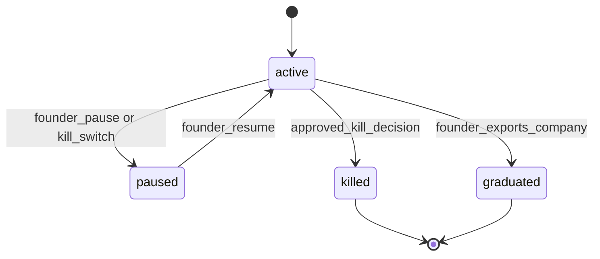
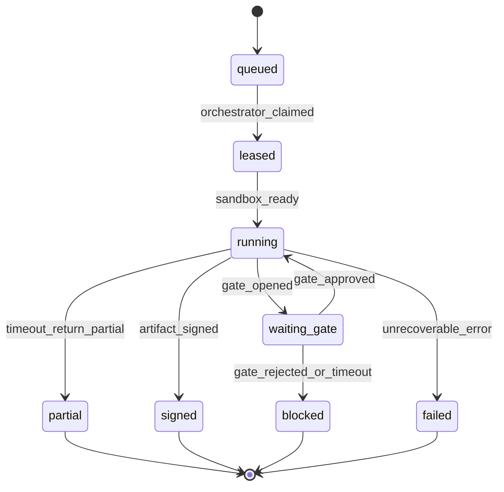
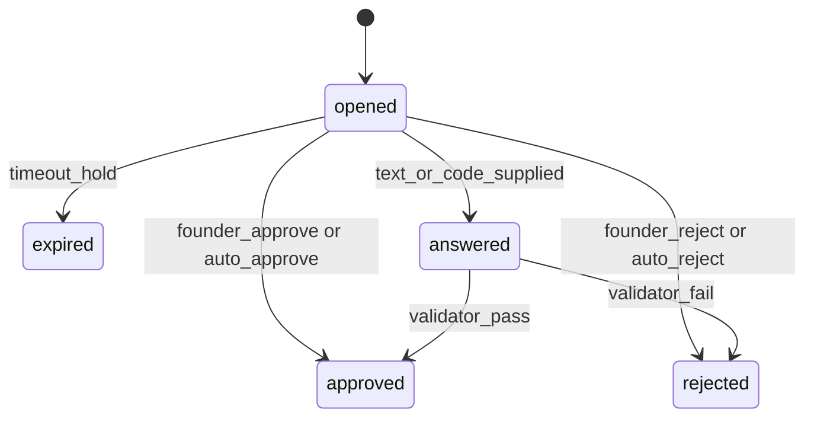
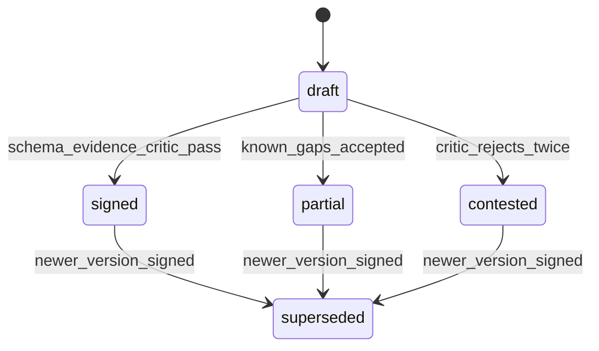
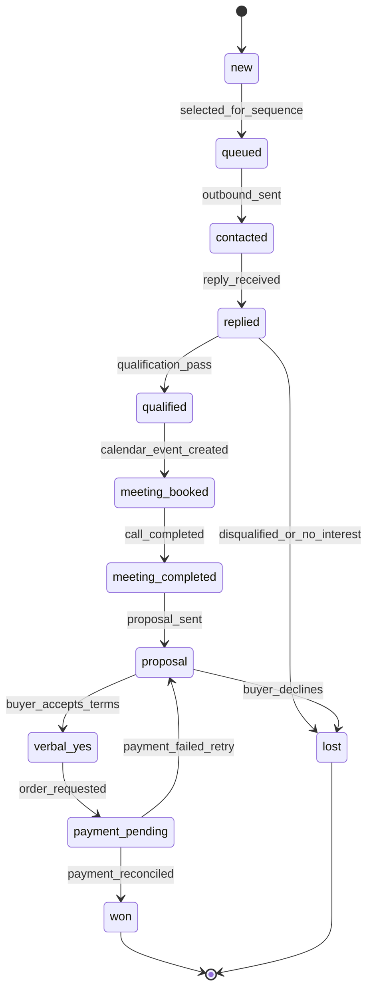
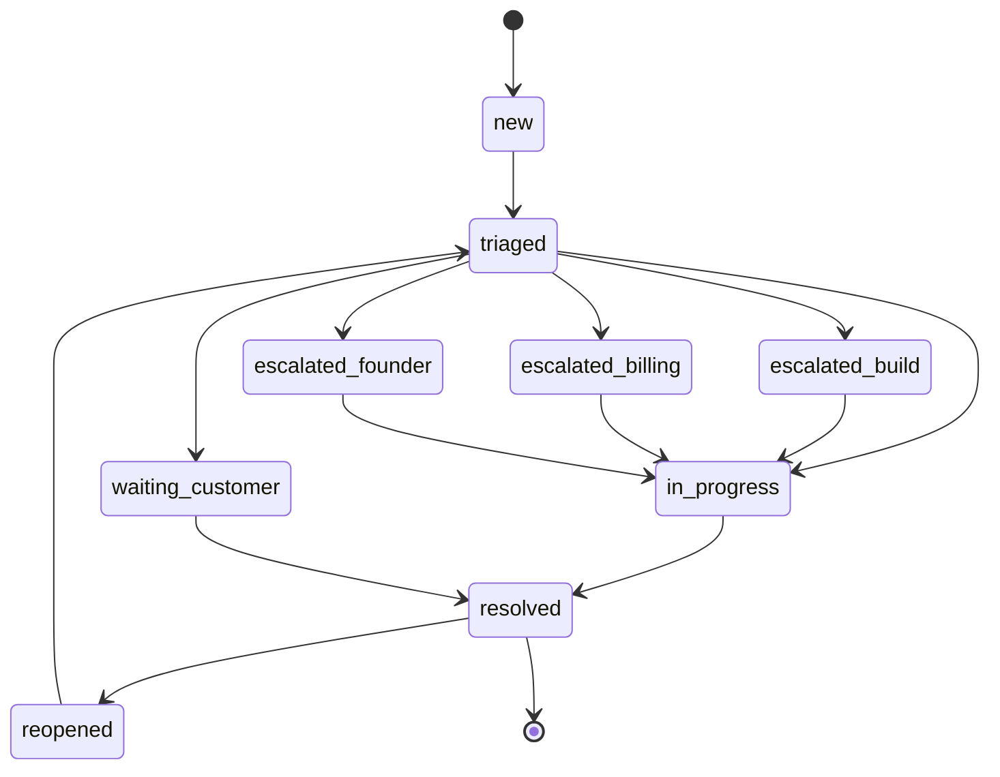
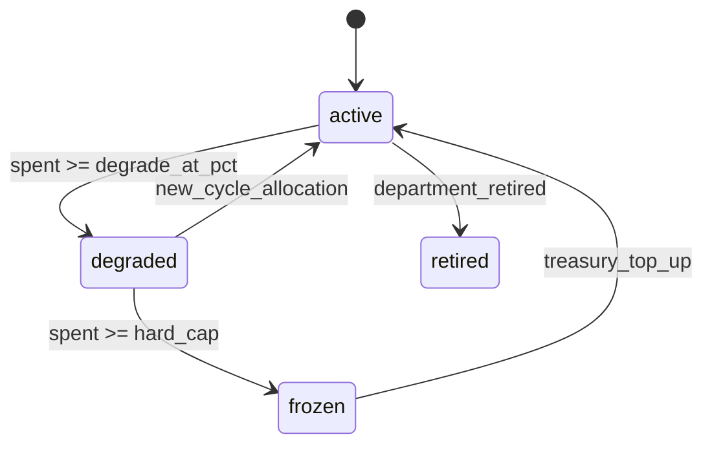
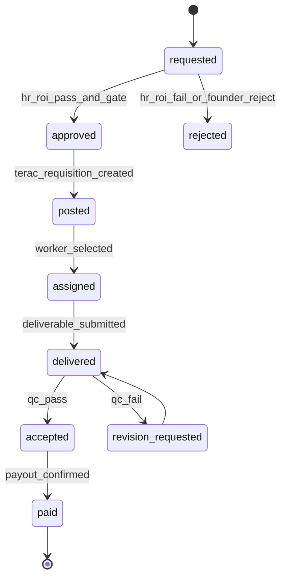
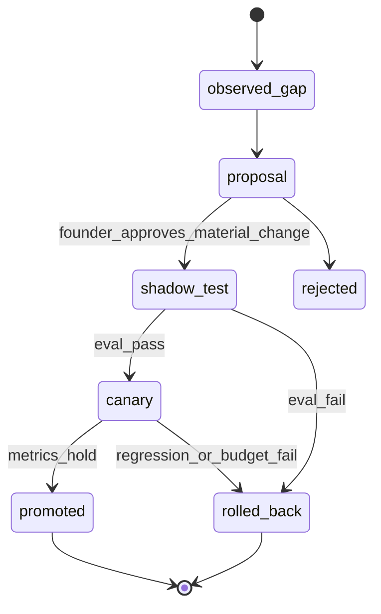

# 18 — State Machines

Purpose: collect the canonical state transitions so reducers, UI, and departments do not invent different lifecycles.

## Venture lifecycle



## Liveness ring

```ts
export const VentureLiveness = z.object({
  idea_locked: z.boolean(),
  market_validated: z.boolean(),
  product_live: z.boolean(),
  pipeline_active: z.boolean(),
  revenue_real: z.boolean(),
});
```

| Segment | Flips true when |
|---|---|
| `idea_locked` | D02 `SharpenedIdea` approved or D06 `ProductSpec` signed |
| `market_validated` | D03/D04/D06 evidence reaches validation threshold |
| `product_live` | D07 deployment health is green |
| `pipeline_active` | D09 releases >= 25 qualified consent-clean leads |
| `revenue_real` | D11 reconciles a paid order; demo test-mode is labeled |

## Work order



## Gate



Gate decisions are immutable events. A later "changed my mind" creates a new gate and compensating
event, not an update.

## Artifact quality



## Deal



## Ticket



## Budget envelope



## Human hire



## Capability improvement



## Assumptions & open questions

- **MVP:** Reducers enforce these transitions; UI never mutates state directly.
- **MVP:** Invalid transitions emit `state.transition_rejected` with reason and trace id.
- **POST-MVP:** Add per-integration sub-state machines for OAuth health and connector rotation.
