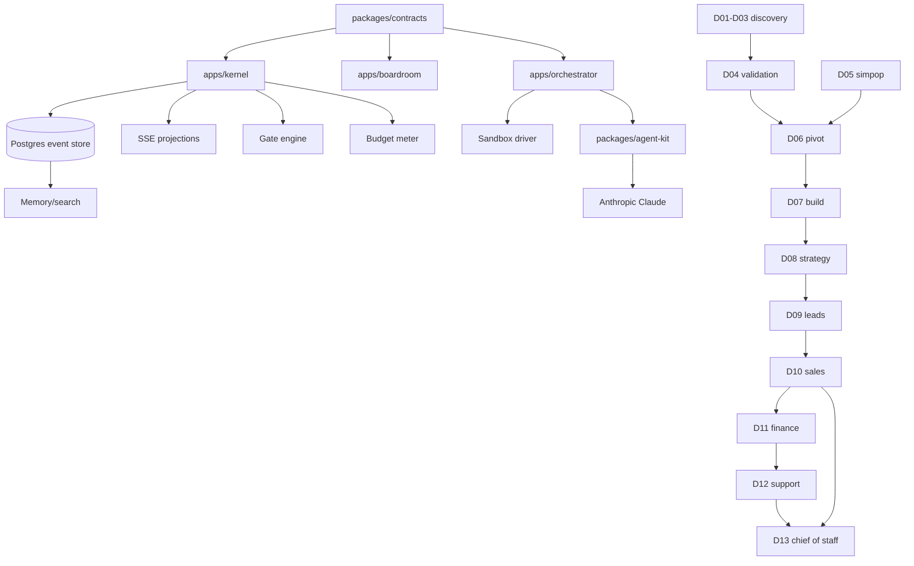

# 11 — Dependency Graph

Purpose: define build order and runtime dependencies so agents can parallelize safely.

## Build DAG

## Critical path

| Order | Dependency | Why it blocks |
|---:|---|---|
| 1 | `packages/contracts` | Every event/artifact/gate validates here |
| 2 | Kernel event store + reducers | Boardroom and agents need a source of truth |
| 3 | Boardroom SSE | Demo depends on visible progress |
| 4 | Gate engine | External side effects cannot run without approvals |
| 5 | Budget meter | Departments must degrade/halt honestly |
| 6 | D01-D06 seed pipeline | Build/GTM need product direction |
| 7 | D07 deployment card | Sales cannot promise unshipped scope |
| 8 | D09/D10/D11 loop | Revenue proof |
| 9 | D13 improvement loop | Finale and core ambition |

## Parallel work lanes

| Lane | Can start after | Files/packages |
|---|---|---|
| UI projection | contracts v0 | Boardroom floor, timeline, cards |
| Department prompts | contracts v0 + docs | `packages/prompts/D*` |
| Integrations | gate engine | Stripe, Composio, Linq, Replay adapters |
| simpop | independent | Rust service, API adapter |
| D07 build agent | GitHub policy | Claude Code runner, PR flow |
| Demo seed | contracts v0 | fixtures, reset command |

## Runtime dependencies by department

| Dept | Hard dependencies | Soft dependencies |
|---|---|---|
| D01 | kernel, artifact registry | document parsers |
| D02 | D01 | market memory |
| D03 | D02, evidence store | Solari/browser |
| D04 | D03, gates, Composio | ElevenLabs |
| D05 | simpop service | D03 questions |
| D06 | D02-D05 | founder Linq |
| D07 | D06, GitHub, Claude Code | Replay, Render |
| D08 | D06/D07 | D03/D04 richer evidence |
| D09 | D08, D04, suppression list | LinkedIn/CRM connectors |
| D10 | D09, D08, D07, gates | ElevenLabs, Linq |
| D11 | money webhooks, D10 | Whop/Dodo/Terac |
| D12 | deployed product, support inbox | product analytics |
| D13 | observability, D10/D12/D11 signals | sandbox fork/canary |

## Assumptions & open questions

- **MVP:** A seeded trace can stand in for unavailable live integrations if the UI labels it.
- **MVP:** D10 depends on D07 shipped-scope artifact even if the product is a demo app.
- **POST-MVP:** Add automated DAG validation in CI so docs and manifests cannot drift.
