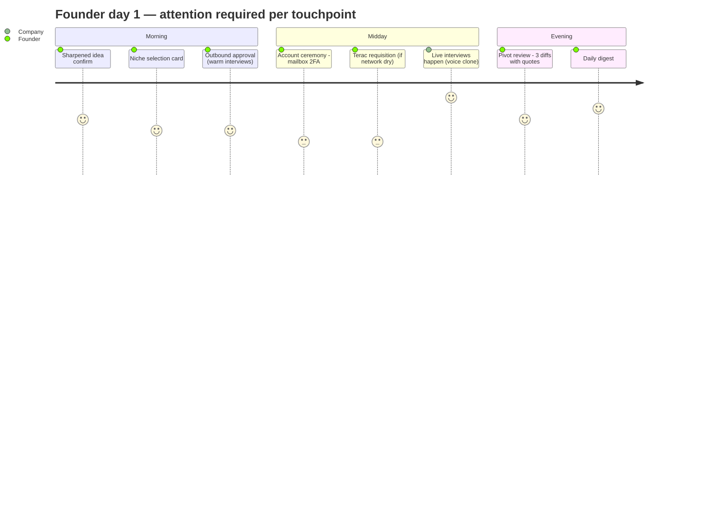
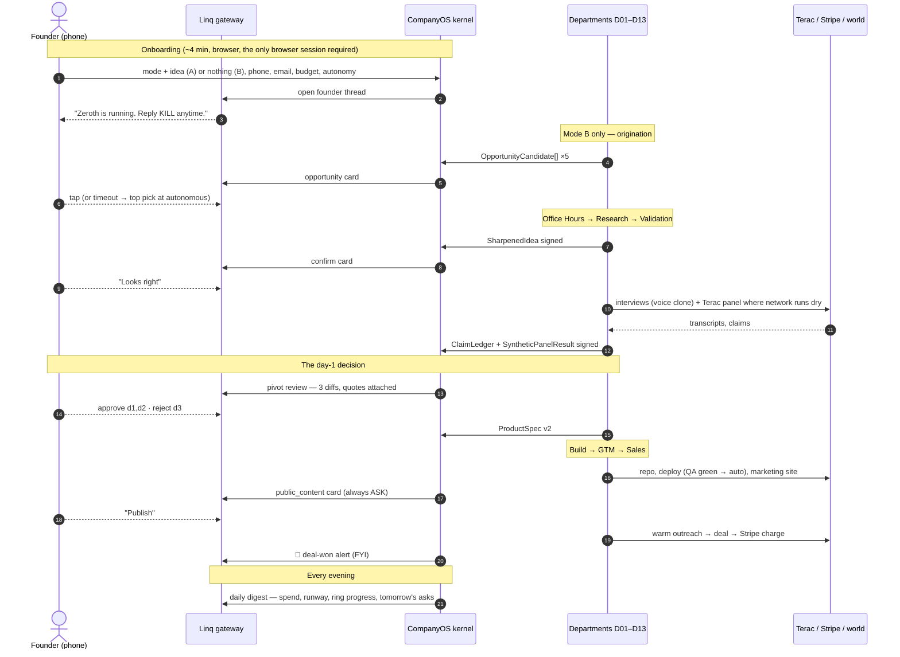

# 01 — The Founder Journey

Everything the founder experiences, end to end, in both entry modes — from the landing page to
week one — and every moment the company asks something of them. This file is the *human* side of
[`../00-START-HERE/02-end-to-end-journey.md`](../00-START-HERE/02-end-to-end-journey.md): same
scenes, but narrated from the phone in the founder's pocket.

The design target, stated once: **the founder never opens a laptop.** Every interaction below is
either a Linq iMessage card, a short typed reply, or an optional glance at the Boardroom. If any
step requires the founder to "go configure something," that step is a bug in this spec.

---

## 1. The two entry modes

```
MODE A — FOUNDER-LED                    MODE B — AUTONOMOUS ORIGINATION
"I have an idea"                        "Find me one"
text / voice / files / links            zero input beyond identity + budget
        │                                        │
        ▼                                        ▼
  D01 parses → IdeaSeed                 D01 origination swarm →
        │                               OpportunityCandidate[] ×5
        │                                        │
        │                          autonomy=autonomous? pick top-scored
        │                          else: Linq card, founder picks one
        │                                        │
        └──────────────┬─────────────────────────┘
                       ▼
             D02 Office Hours → SharpenedIdea
```

The two modes converge at Office Hours and are identical afterward. Every difference is in the
first ten minutes, so this file describes onboarding once and marks the deltas `MODE A` / `MODE B`.

---

## 2. Onboarding — the first session (~4 minutes of founder time)

**MVP** — this is the demo's opening.

### Step-by-step

| # | Screen / message | Founder does | System does | Time |
|---|---|---|---|---|
| 1 | Entry page: two doors — "I have an idea" / "Find me one" | Taps one | `venture.created`, `venture.mode_set` | 5s |
| 2 | `MODE A` only: idea box — free text, voice recorder, file dropzone (pdf/docx/md/png/Figma link) | Dumps whatever exists — a sentence is enough | D01 `parser` normalizes to `IdeaSeed`; missing pieces become `assumption: unverified`, never blockers | 60s |
| 3 | Identity: phone number (Linq), email | Enters both, taps the Linq verification link that arrives by iMessage | `founders` row created; Linq thread opened; this thread is now the primary interface | 45s |
| 4 | Budget: "How much can Zeroth spend?" — slider with presets $20 / $50 / $150, and a Terac sub-cap | Picks a number | `founders.spend_cap_usd`, `founders.terac_cap_usd` set; Treasury computes the first cycle allocation ([`../01-platform/08-money-and-metering.md`](../01-platform/08-money-and-metering.md)) | 20s |
| 5 | Autonomy dial: `copilot / supervised / autonomous`, one paragraph each, honest about what auto-approves ([decision table](../01-platform/06-human-in-the-loop.md)) | Picks a level (default: `supervised`) | `venture.autonomy_level` set | 20s |
| 6 | Quiet hours: default 22:00–07:00, editable | Usually accepts default | `founders.quiet_hours` set | 5s |
| 7 | Optional account connections (next section) | Connects 0 or more | Composio OAuth grants, scoped to the venture | 0–90s |
| 8 | "Zeroth is running." One screen: what happens next, the kill word (`KILL`), the Boardroom URL | Closes the tab | First `WorkOrder` issued to D01/D02 | 10s |

Nothing in onboarding is a hard prerequisite except phone + email + budget. Everything else can be
supplied later when a department actually needs it — and the company will ask over Linq at that
exact moment rather than front-loading a settings page.

### Step 7 in detail — connecting accounts

All optional, all via Composio OAuth, all read-scoped by default
([`../01-platform/07-identity-and-accounts.md`](../01-platform/07-identity-and-accounts.md) —
the founder's own tokens are never used for outbound):

| Connection | Who uses it | What it unlocks | If skipped |
|---|---|---|---|
| Gmail (read) | D04 | Mining the founder's network for ICP-matched interviewees | Terac panels + cold sourcing only; validation is slower and costs more |
| LinkedIn | D04, D09 | First/second-degree warm outreach | Cold lists only |
| Calendar | D04, D10 | Booking discovery and sales calls without ping-pong | Scheduling links instead |
| GitHub (read) | D07 | Reusing the founder's existing code/repos as input | Company builds from scratch in its own org |
| Voice sample (90s read-aloud) | D04, D10 | ElevenLabs clone: interviews and sales calls in the founder's voice | A stock disclosed-AI voice is used instead |

**The pitch line for this screen:** "Every connection makes the company cheaper and warmer.
None is required." The system re-offers a skipped connection exactly once, at the moment a
department files the Escalation that it would have prevented.

**POST-MVP:** importing a half-dead Notion doc as `IdeaSeed`, Slack as an alternative to Linq.

---

## 3. The first 10 minutes

What the founder sees after closing the tab, minute by minute. Times assume demo `time_scale`;
production times in parentheses.

### MODE A — founder-led

| t | Channel | What happens | Founder action |
|---|---|---|---|
| 0:00 | — | D02 Office Hours begins the grilling | None |
| 0:30 | Linq | *"Office Hours has 3 questions it can't answer from your notes. 2 min now, or I'll assume and flag."* Deep link to a typed Q&A | **Optional.** Answering sharpens; silence produces `assumption: unverified` flags |
| 2:00 (20m) | Linq | `SharpenedIdea` card: one-liner, ICP, wedge, kill criteria. Buttons: **Looks right** / **Fix something** | One tap, or a free-text redirect |
| 2:30 | — | D03 research swarm + D04 network mining + D05 panel build all fan out (routing: `artifact.signed(SharpenedIdea)`) | None |
| 6:00 (90m) | Linq | Niche selection card: top 3 `NicheDossier`s, swipeable, cited MRR ranges, recommended one pre-selected | One tap (auto-picks at `autonomous` after timeout) |
| 8:00 | Linq | First `outbound_to_real_person` gate: *"Email 9 people from your network for interviews — here is the exact email"* | Approve / Sample 1 first / Hold |
| 10:00 | — | Interviews are being scheduled; the synthetic panel is running. The founder's job is done for hours | None |

### MODE B — autonomous origination

| t | Channel | What happens | Founder action |
|---|---|---|---|
| 0:00 | — | Origination swarm reads Reddit clusters, G2 1-star reviews, job postings, App Store sentiment, regulatory diffs | None |
| 3:00 (45m) | Linq | Opportunity card: 5 `OpportunityCandidate`s, thesis + score + evidence count each. `autonomous`: FYI with top pick pre-chosen, 10-min override window. Else: pick one | One tap or none |
| 3:30 | — | Chosen candidate → D02 Office Hours; from here identical to Mode A at t=0:00 | None |

**Total founder attention in the first 10 minutes: 3–5 taps, zero typing required.**

---

## 4. Day 1

By the end of day 1 a healthy venture has: `idea_locked`, research done, interviews booked or
done, the panel run, and a pivot review either delivered or scheduled. The founder's day 1
touchpoints, in likely order:



| Touchpoint | Gate / mechanism | Typical count day 1 | Founder cost |
|---|---|---|---|
| Idea + niche confirmations | `pivot_approval`-family cards | 2 | 2 taps |
| Outbound approvals | `outbound_to_real_person` (warm auto-approves at `supervised`+) | 0–2 | 0–2 taps |
| Account ceremonies (mailbox, then whatever departments hit) | `account_creation`, OTP relay | 1–3 | ~30s each ([`05-account-ceremony.md`](05-account-ceremony.md)) |
| Money asks above threshold (Terac panel, domain) | `money_out` | 0–2 | 1 tap each |
| Pivot review | `pivot_approval`, per-diff toggles | 1 | the day's real decision — 1–3 min |
| Daily digest | scheduled message, not a gate | 1 | read-only |

**The pivot review is the emotional center of day 1.** It is the first time the company comes back
with something the founder did not know: verbatim quotes from real people, a synthetic-panel read
with `evidence_class` labeled, and 2–4 `IdeaDiff`s with evidence, cost, and reversibility. Message
template in [`02-founder-messaging-flows.md`](02-founder-messaging-flows.md) §4.

What the founder does **not** see on day 1: agent retries (rungs 0–2 of the
[escalation ladder](../01-platform/06-human-in-the-loop.md) are silent), budget metering, sandbox
lifecycle, bus traffic. All of it is in the Boardroom if they're curious; none of it interrupts.

---

## 5. Week 1

The week-1 arc is the five-segment "alive" ring from
[`../00-START-HERE/01-north-star.md`](../00-START-HERE/01-north-star.md) filling in:

| Day (prod) | Milestone | Founder touchpoints |
|---|---|---|
| 1 | `idea_locked`, `market_validated` in progress | The day-1 list above |
| 2 | Pivot applied → `ProductSpec v2` → D07 starts building; D08 drafts GTM | `pivot_approval` taps; maybe a domain `money_out` (~$12 — the first real money the company spends on itself) |
| 3 | `product_live`: deploy gate (auto at `supervised`+ if QA green in Replay); marketing site copy | `deploy` card (often auto, FYI only); `public_content` card — **always ASK, never auto** |
| 4 | `pipeline_active`: leads built, sequences drafted | Cold outbound gate if >50/day or `supervised`; warm sequences flow |
| 5 | First sales calls (voice clone), first payment link | `public_content` for pricing page; deal alerts (FYI) |
| 6–7 | `revenue_real`: first Stripe charge; Treasury reallocates from real revenue | Deal-won alert; weekly digest; possibly the first `refund` or support escalation |

### Cadence by autonomy level, week 1 (estimates, labeled as such)

| | copilot | supervised | autonomous |
|---|---|---|---|
| Cards/day | 15–25 | 5–9 | 2–4 |
| Of which need a decision | all | ~half | mostly `public_content` + `money_out` > $25 |
| Founder minutes/day | 30–45 | 8–15 | 3–6 |

The batcher ([`06-human-in-the-loop.md` Part 5](../01-platform/06-human-in-the-loop.md)) keeps the
card count honest: 2–6 same-family gates arrive as one stacked card, and quiet hours defer
everything except `risk='high'`.

---

## 6. Every touchpoint where the company asks something of the founder

The complete inventory. If a founder-facing ask exists that is not in this table, it is
unspecified and must be added here first. Templates for each in
[`02-founder-messaging-flows.md`](02-founder-messaging-flows.md).

| # | Ask | Trigger | Channel | Can it auto-resolve? |
|---|---|---|---|---|
| 1 | Approve spend (`money_out`) | Terac hire, domain, paid tool, ad spend | Linq | ≤$25 by autonomy table; >$25 never |
| 2 | Approve public content | Site copy, social post, Whop listing | Linq (with rendered preview) | **Never** |
| 3 | Approve outbound to a real person | First email/DM/call to a non-opted-in human | Linq | Warm: yes at `supervised`+. Cold ≤50/day: `autonomous` only |
| 4 | Approve a pivot diff | D06 decision packet | Linq, per-diff toggles | Reversible diffs with ≥3 claims: at `supervised`+ |
| 5 | Approve a production deploy | D07 QA complete | Linq | Auto if QA green, at `supervised`+ |
| 6 | Approve a refund | D12/D11 recommendation | Linq | ≤$50, first refund: auto at `supervised`+ |
| 7 | Approve a new department | D13 `CapabilityGap` + shadow results | Linq + Boardroom | **Never** |
| 8 | Blocked-action handoff: 2FA / OTP | Account ceremony hits a code screen | Linq OTP card | No — no agent can invent a credential |
| 9 | Blocked-action handoff: CAPTCHA | Ceremony hits a human check | Linq + deep link to the live session | No — never solved or outsourced, by policy |
| 10 | Blocked-action handoff: payment method / ID / KYC | Stripe onboarding, any card form | Linq → founder's own browser | No — the company never sees the number |
| 11 | Blocked-action handoff: ToS / legal agreement | Checkbox near "I agree" | Linq with ToS link + plain-language summary | No |
| 12 | Budget requisition | Treasury denies and `runway < request` | Linq | Only this narrow path reaches the founder; Treasury absorbs the rest |
| 13 | Pick an opportunity (Mode B) / a niche | D01 / D03 output ready | Linq swipe cards | At `autonomous`: pre-picked, override window |
| 14 | Answer Office Hours questions | D02 can't answer from intake material | Linq deep link | Yes — silence produces flagged assumptions, not a stall |
| 15 | Escalation rung 4: "we're stuck, choose" | Ladder reaches the founder | Linq multiple-choice with a recommended option | The company never asks an open question |
| 16 | Deal / incident / digest notifications | Deal won, kill-worthy incident, daily 18:00 | Linq | FYI — no reply expected (incident may carry actions) |

Three properties hold across all sixteen, enforced by the kernel, not by prompts:

1. **Multiple choice, never open-ended.** Every ask carries 2–4 buttons with consequences spelled
   out and a recommended option pre-selected (`Escalation.options`, `LinqCardBase.buttons`).
2. **Free text never approves.** An ambiguous reply becomes a `redirect` with the note attached
   ([reply parsing](../01-platform/06-human-in-the-loop.md)).
3. **Every ask has a timeout and a declared `on_timeout`.** The founder ignoring their phone
   degrades the work (`gaps[]`, `hold`) — it never fabricates consent, except the two
   customer-favorable defaults (`refund` → auto-approve, QA-green `deploy` → auto-approve).

---

## 7. The full journey as one sequence

**MVP** — this diagram is the demo script from the founder's seat.



---

## 8. What the founder owns vs what the company owns

A clean division of labor, so no spec ever quietly moves an item across this line. This table is
the founder-side complement of the [prohibited-actions
table](../01-platform/07-identity-and-accounts.md): those say what agents may never do; this says
what the founder can never delegate.

| Always the founder | Always the company | Negotiated by autonomy level |
|---|---|---|
| Passwords, payment cards, government ID, KYC selfies | Retries, sibling reassignment, re-planning (ladder rungs 0–3) | Money out ≤ $25 |
| CAPTCHA solving | Budget metering and cycle reallocation within the envelope | Warm/cold outbound |
| Public speech under their brand (`public_content`) | Evidence collection, citation, `gaps[]` bookkeeping | Reversible pivot diffs |
| Implanting a new department (`new_department`) | Interview scheduling, transcription, claim extraction | Production deploys (QA green) |
| ToS acceptance, legal commitments | Preview deploys, repo management, QA | Refunds ≤ $50 |
| Setting and raising `spend_cap_usd` / `terac_cap_usd` | Choosing which sandbox, model tier, or tool to use | Account ceremonies (free, no payment method) |
| The kill switch, and resuming after it | Drafting everything — the founder edits, never authors | Terac hires within `terac_cap_usd` |

Two consequences worth stating:

- **The founder is an approver, not an operator.** They never assign work, never pick a tool,
  never write a prompt. If they want to steer, the mechanism is a redirect note or an autonomy
  downshift, both of which flow through existing gates — no side channel.
- **The company is a drafter, not a publisher.** Everything customer-visible existed as a
  rendered preview on the founder's phone before the world saw it. This is what makes
  "autonomous" defensible in front of a judge.

---

## 9. The Boardroom's place in the founder journey

The phone is the interface; the Boardroom is the *glass*. The founder never needs it, but three
moments pull them in, each via a deep link from a Linq card (spec:
[`../01-platform/09-boardroom-ui.md`](../01-platform/09-boardroom-ui.md)):

| Moment | What they look at | Why the phone wasn't enough |
|---|---|---|
| **Curiosity, hour 1** ("what is it doing?") | The isometric floor plan, sprites walking work orders between rooms, live activity stream | Ambient reassurance doesn't fit in a card |
| **A big decision** (pivot with contested evidence, new department) | Evidence drawer: verbatim quotes with speaker + timestamp, `source_id` chains, shadow-test results | Cards carry summaries; the drawer carries proof |
| **Something feels wrong** | Escalation view, budget/runway panel, per-department freeze, the kill switch | Diagnosis needs the whole picture at once |

The Boardroom is read-mostly for the founder: its only write actions are the same gate decisions
available on the phone, plus freeze/kill/autonomy controls. Approving in one place resolves the
card in the other within one SSE tick — there is exactly one gate record either way.

---

## 10. Failure & edge journeys

**MVP** where marked; the rest **POST-MVP**.

| Journey | What the founder experiences | Spec |
|---|---|---|
| **Founder goes dark for 48h** (**MVP**) | Gates hit `on_timeout`: money auto-rejects, content holds, ceremonies pause (Superserve keeps the VM). Work ships `partial` with `gaps[]`. Digest keeps arriving. Nothing is fabricated | [`06-human-in-the-loop.md`](../01-platform/06-human-in-the-loop.md) |
| **Founder says KILL** (**MVP**) | Halt within one tick; banner lists in-flight effects with one-tap compensations (refund, retract Terac job, rollback). Resume is an explicit action; killed gates are not auto-reopened | kill semantics, Part 8 |
| **Founder downshifts autonomy** | `autonomous → supervised`: pending gates re-evaluated under the stricter policy immediately | softer controls table |
| **Budget exhausted mid-week** | Treasury freezes the hungriest department, files requisition; founder gets one `money_out`-family card: top-up / reallocate / let it stall | [`08-money-and-metering.md`](../01-platform/08-money-and-metering.md) |
| **Validation says the idea is bad** | The pivot review says so, with quotes, and proposes `PIVOT` or kill-criteria review. Honest negative results are a feature — kill criteria were signed into the `SharpenedIdea` on day 1 | D06 |
| **Founder wants to intervene mid-flight** | Free text on the Linq thread → filed as a founder note, routed to D13, becomes context. Boardroom offers per-department freeze | reply parsing rule 4 |

---

## Assumptions & open questions

- **Assumption:** the founder has an iPhone (Linq is iMessage-first). Fallback channel for
  Android/SMS-only founders is Linq's SMS mode with plain-text cards; the button grammar degrades
  to numbered replies. Unverified how much the stacked-card UX survives that.
- **Assumption:** onboarding budget presets ($20/$50/$150) are right for the demo audience.
  `founders.spend_cap_usd` default in the data model is $50; keep them consistent.
- **Assumption:** one founder per venture (per the north star's "one founder, N ventures"
  non-goal). Co-founders sharing an approval thread would break the "most recent pending gate"
  keyword-reply heuristic and are out of scope.
- **Open:** should Mode B require *any* founder input beyond identity + budget (e.g. "industries
  I refuse to work in")? Current spec: an optional exclusions list, default empty. An
  auto-originated gambling/vice venture would be an avoidable embarrassment; a denylist seed is
  cheap. Leaning yes, **MVP**.
- **Open:** the 10-minute override window for Mode B's auto-picked opportunity at `autonomous` is
  invented here; no other gate has an "FYI with override" shape. Either promote it to a first-class
  gate state (`fyi_overridable`) or model it as a `pivot_approval` with `on_timeout='auto_approve'`.
  The latter needs no schema change — preferred.
- **Open:** does the voice-sample step in onboarding need explicit consent language for the
  founder's own clone (it will speak to strangers)? Compliance file says disclosure-at-call-open
  covers the listener; the *founder's* consent to be cloned should be an explicit checkbox.
  **MVP**, one line.
- **Open:** week-1 cadence numbers (§5) are estimates, not measurements. Instrument the demo seed
  venture and replace them with observed counts before judging.
