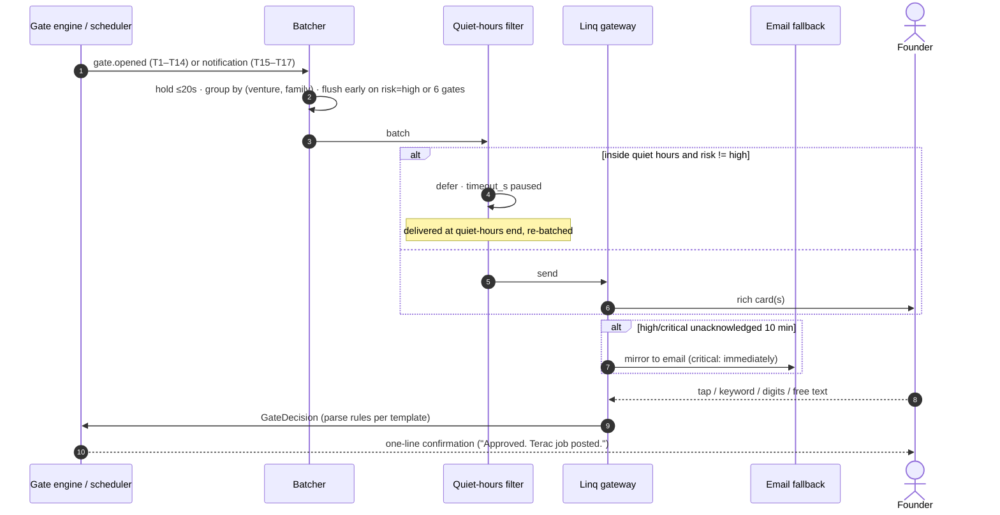

# 02 — Founder Messaging Flows

Every message the system may send the founder, as concrete templates. This file is the message
catalog for the Linq gateway (`services/gateway-linq`) and the notification renderer in the
Boardroom. If a department wants to say something to the founder that has no template here, the
tool plane rejects the send — the same closed-list discipline as the
[eight gate types](../01-platform/06-human-in-the-loop.md).

All approval cards inherit `LinqCardBase`
([`06-human-in-the-loop.md` Part 6](../01-platform/06-human-in-the-loop.md)): `gate_id`,
`headline ≤80`, `subline ≤140`, `risk`, `expires_in_s`, 2–4 `buttons` with `consequence` text,
`deep_link`, optional `reply_hint`. Templates below specify only what they add.

---

## 0. The catalog at a glance

| # | Template | Kind | Channel | Urgency | Quiet hours |
|---|---|---|---|---|---|
| T1 | `money_out` approval | gate | Linq | high | rings through if > $25, else deferred |
| T2 | `public_content` approval | gate | Linq | medium | deferred |
| T3 | `outbound_to_real_person` approval | gate | Linq | medium | deferred |
| T4 | Pivot proposal (`pivot_approval`) | gate | Linq + Boardroom | high | one-way diffs ring through |
| T5 | `deploy` approval | gate | Linq | medium | deferred |
| T6 | `refund` approval | gate | Linq | medium | deferred |
| T7 | `new_department` proposal | gate | Linq + Boardroom | high | rings through |
| T8 | Blocked action: 2FA / OTP | ceremony | Linq | high | rings through* |
| T9 | Blocked action: CAPTCHA | ceremony | Linq | high | rings through* |
| T10 | Blocked action: phone verification | ceremony | Linq | medium | deferred |
| T11 | Blocked action: payment entry | ceremony | Linq → founder's browser | high | deferred |
| T12 | Blocked action: ID / KYC verification | ceremony | Linq → founder's browser | high | deferred |
| T13 | Blocked action: legal agreement / ToS | ceremony | Linq | medium | deferred |
| T14 | Budget requisition | gate (`money_out` family) | Linq | high | rings through |
| T15 | Deal alert | notification | Linq | low | deferred |
| T16 | Incident alert | notification | Linq + email | critical | **always rings through** |
| T17 | Daily digest | scheduled | Linq (email fallback) | low | scheduled outside quiet hours by construction |
| T18 | Weekly digest | scheduled | email + Boardroom | low | n/a |

*T8/T9 ring through only if the ceremony was founder-initiated or blocks a `risk='high'` chain;
otherwise the ceremony `hold`s until morning (Superserve keeps the VM, resumption is free).

**Channels.** `Linq` = rich interactive iMessage, the primary surface. `email` = fallback and
long-form archive; every Linq send with `urgency ∈ {high, critical}` mirrors to email after 10
unacknowledged minutes. `Boardroom` = the card also appears in the approval inbox
([`../01-platform/09-boardroom-ui.md`](../01-platform/09-boardroom-ui.md)) the moment the gate opens, regardless of channel.

**Reply grammar, global.** All templates accept: button taps (authoritative), the deterministic
keywords (`yes|y|ok|approve|go|ship` → approve; `no|n|stop|reject|hold` → reject;
`kill|halt|freeze` → kill switch), ordinal batch grammar (`"1 and 3 yes, 2 no"`), and free text →
`redirect` with note. **Free text never approves.** Per-template rows below only list *additions*
to this grammar (e.g. OTP digits, amount counters).

---

## 1. Approval cards (T1–T7)

### T1 — `money_out`

| Field | Value |
|---|---|
| Channel | Linq |
| Urgency | high |
| Quiet hours | ≤ $25: deferred. > $25: `risk='high'`, rings through |
| Reply grammar | buttons; keywords; **a bare dollar amount** (`"9"`, `"$9"`) → counter-offer, re-opens the gate at that cap |
| Parsing | amount regex `^\$?\d+(\.\d{2})?$` → `option_id:'cheaper'` with `cap_usd`; anything else free-text → redirect |
| Timeout | 3600s prod / 45s demo → `auto_reject` (money never flows on silence) |

Required fields beyond base: `amount_usd`, `why_agent_cannot` (Terac hires), `expected_value`,
`runway_after_usd`. Example rendered (the Terac-nurses card, canonical, from
[`06-human-in-the-loop.md`](../01-platform/06-human-in-the-loop.md)):

> **Spend $18.00 — hire 3 verified ER nurses**
> Outreach ran out of network. Terac panel, 20-min interviews, delivered by 6pm.
> Amount **$18.00** · Why no agent can do it: *licensed clinical experience* · Runway after **$41.20**
> [ Approve $18 ] [ Cap at $9 ] [ Skip ]

### T2 — `public_content`

| Field | Value |
|---|---|
| Channel | Linq. Card carries the **rendered** content (image preview), never a description |
| Urgency | medium |
| Quiet hours | deferred |
| Reply grammar | buttons; free text → `redirect` treated as edit instructions ("make it less salesy") |
| Timeout | 7200s / 60s → `hold` — unpublished content harms nobody |

Required: `preview` (image or link), `claims_made` count, `cited_sources`. **Never auto-approves
at any autonomy level** — the template renders no "auto-approved" variant, by construction.

> **Publish landing page copy**
> zeroth-dental.com — hero, 3 sections, pricing
> 🖼 *[preview image]* · Claims made: **3 quantitative — all cited**
> [ Publish ] [ Change tone ] [ Not yet ]

### T3 — `outbound_to_real_person`

| Field | Value |
|---|---|
| Channel | Linq. Carries the **exact** message and the consent basis for each recipient class |
| Urgency | medium |
| Quiet hours | deferred (outreach at 2am is bad for the recipients too) |
| Reply grammar | buttons; `"send 1"` / `"sample"` → `option_id:'sample'`; a bare integer → cap the send count |
| Timeout | 1800s / 30s → `auto_reject` |

Required: `sample` (to/subject/body of one real message), `consent_basis`, `suppressed_count`
(DNC/opt-out exclusions, always shown even when zero).

> **Email 12 warm leads**
> All 12 were interviewed by us. Each email quotes their own words.
> Sample → P3 — ops lead, 40-person dental group: *"You said approvals were your worst hour…"*
> Consent basis: **Interviewed + opted in** · Suppressed: **2 (DNC), not included**
> [ Send 12 ] [ Send 1 first ] [ Hold ]

### T4 — Pivot proposal (`pivot_approval`)

| Field | Value |
|---|---|
| Channel | Linq + Boardroom (evidence drawer deep-linked per diff) |
| Urgency | high |
| Quiet hours | reversible-only packet: deferred. Any `one_way_door` diff: rings through |
| Reply grammar | buttons; per-diff ordinals (`"1 and 3 yes, 2 no"` → per-diff decisions); `"why 2"` → sends the full evidence chain for diff 2, gate stays pending |
| Parsing | ordinal grammar maps to `diffs[].id` in display order; a partial parse across the batch falls back to re-sending the digest once, then `hold` |
| Timeout | 10800s / 90s → `hold` — the spec does not move without a decision |

Required per diff: `op ∈ {ADD, CUT, NARROW, REPRICE, PIVOT}`, `before`, `after`, one verbatim
`quote` with speaker, `reversibility`, `recommended`. The full example is the three-diff card in
[`06-human-in-the-loop.md` Part 6](../01-platform/06-human-in-the-loop.md); it is the demo's
emotional beat and the one template that gets per-item toggles rather than stacked cards.

### T5 — `deploy`

Timeout 1800s / 30s → `auto_approve` if QA green else `hold`. Required: `url`, `qa_summary`
(`12/12 passed`), `commit_sha`, `rollback` promise ("one tap, 40s"). At `supervised`+ with QA
green this usually arrives already `auto_approved` — same card, badge instead of buttons, because
an auto-approved gate is exactly as auditable as a tapped one.

### T6 — `refund`

Timeout 3600s / 45s → `auto_approve` (customer-favorable default — the only template whose
silence spends money, and it is stated on the card: *"Auto-refunds in 60 min if you don't
reply."*). Reply grammar adds `"50%"` / a bare amount → partial refund. Required:
`customer_since`, `prior_refunds`, `support_recommendation`.

### T7 — `new_department`

The finale card. Timeout 86400s / 120s → `hold`. Never auto-approves. Required: `evidence`
(lost-deal count + ARR), `shadow_test` results, `cost_per_run`, `reversible` promise. Third
button is always **Keep in shadow mode** — the safe middle that keeps the demo honest. Rendered
example in [`06-human-in-the-loop.md` Part 6](../01-platform/06-human-in-the-loop.md).

---

## 2. Blocked-action requests (T8–T13)

These are ceremony pauses from
[`07-identity-and-accounts.md`](../01-platform/07-identity-and-accounts.md), delivered as
`account_creation` gates. Shared frame: what the company was doing, which step blocked it, a
**redacted** screenshot, and an abort button. Shared timeout: 1800s / 30s → `hold` (the Solari
session is frozen, the sandbox pauses at 10% billing; resumption hours later is free). Full
resumption protocol in [`05-account-ceremony.md`](05-account-ceremony.md).

### T8 — 2FA / OTP relay

| Field | Value |
|---|---|
| Urgency | high — OTPs expire in minutes |
| Quiet hours | rings through if founder-initiated or blocking a high chain, else ceremony holds to morning |
| Reply grammar | **4–8 digit reply → OTP branch**: routed to the vault, injected into the Solari session, never enters an agent's context, never logged. Buttons: `Send code` (with inline input), `Cancel signup` |
| Parsing | `/^\s*\d{4,8}\s*$/` AND `awaitingOtp(thread)` → secret path. A digit string with no awaiting ceremony is treated as free text |
| On expiry of the *provider's* code | ceremony retries the "resend code" affordance once, then re-sends this card with attempt 2/2 |

> **GitHub needs a 2FA code**
> Creating the company's own GitHub org: zeroth-dental
> Step: **Phone verification** · Sent to: **your number, from GitHub**
> ▸ *Reply with the 6-digit code*
> [ Send code ] [ Cancel signup ]

### T9 — CAPTCHA

| Field | Value |
|---|---|
| Urgency | high |
| Reply grammar | `done|solved|ok` → resume and re-classify the page; `skip` → abort strategy, ceremony falls to next (usually none → Escalation `needs_credential`) |
| Special | Deep link opens a **founder-visible view of the live Solari session** (view + input on the CAPTCHA iframe only). The company never solves or outsources a CAPTCHA — this is a stated product boundary, and the card says so |

> **Human check at Stripe signup**
> Stripe wants proof a human is present. We don't solve these — that's you.
> 🖼 *[redacted screenshot]* · Takes ~10 seconds.
> ▸ *Tap to solve in the live session, then reply "done"*
> [ Open session ] [ Cancel signup ]

### T10 — Phone verification

Reply grammar adds: a phone number in the reply → `E.164`-normalized, confirmed back
(*"Use +1 415 …? yes/no"*) before injection. Default button offers the founder's number on file.
The number is PII but not a secret; it flows through the normal payload path, unlike OTPs.

> **Render asks for a phone number**
> Company account setup. We can use your number on file, or reply with another.
> [ Use my number ] [ Cancel signup ]

### T11 — Payment entry

The company never sees the number: the card's deep link opens the provider's own payment page (or
a founder-session takeover of the Solari browser) and the founder types the card in themselves.
Reply grammar: `done` → resume and verify a payment method now exists via the provider UI/API;
`no` → abort. This gate is simultaneously a `money_out` if the signup carries a charge, and both
gates render as one card with the amount up front.

> **Apify needs a payment card — $0 today, $5/mo after trial**
> Leads dept is blocked on a scraper. You enter the card; we never see it.
> ▸ *Tap, enter card on Apify's page, reply "done"*
> [ Open Apify checkout ] [ Find a free alternative ] [ Skip — Leads ships with gaps ]

### T12 — ID / KYC verification

Same pattern as T11: founder-only, in their own browser, `id_check` classified steps (document
upload, selfie liveness, SSN/EIN). Canonical case: Stripe account payouts — a hard stop until done.
The card is honest about duration (*"Stripe usually verifies within a day"*), and the ceremony
holds with the sandbox paused for however long the provider takes; a webhook or daily re-check
resumes it.

> **Stripe needs to verify you before payouts**
> Charges work now; money can't reach your bank until KYC is done. ~5 min + Stripe review.
> [ Start verification ] [ Later — remind me at 6pm ]

`Later` is a template-specific button that re-schedules the card, once, outside quiet hours.

### T13 — Legal agreement / ToS

Required: ToS URL, a plain-language summary (**generated summary, labeled as such — the summary
is a convenience, the link is the agreement**), and any unusual clauses the classifier flagged
(arbitration, data resale, exclusivity). Reply grammar: buttons only for accept; free text →
redirect. The company never accepts terms on the founder's behalf without this card.

> **Whop seller agreement — your call**
> To list the product on Whop, someone must accept their seller terms.
> Summary (ours, not theirs): *15% platform fee, weekly payouts, you keep IP.*
> Flagged: **mandatory arbitration clause**. Full text: whop.com/terms
> [ Accept terms ] [ Read first ] [ Don't use Whop ]

---

## 3. Budget requisitions (T14)

Fired only on the narrow path where Treasury cannot solve it internally: a department filed
`Escalation(needs_budget)`, Treasury denied, and `runway < request`
([`08-money-and-metering.md`](../01-platform/08-money-and-metering.md)). Everything below that
threshold is reallocation the founder reads about in the digest, not a card.

| Field | Value |
|---|---|
| Channel | Linq |
| Urgency | high |
| Quiet hours | rings through (a stalled venture burns paused-sandbox dollars while waiting) |
| Reply grammar | buttons; bare amount → counter-offer top-up; `"move it from build"` free text → redirect to Treasury with the note |
| Timeout | 3600s / 45s → `auto_reject`; the department ships `partial` with `gaps[]` |

Required: requesting department, what stalls without it, `runway_usd`, the three options costed.

> **Outreach is out of budget — runway can't cover it**
> 4 interviews booked, no budget to run the calls ($3.10 needed, $1.90 runway free).
> Option A: top up $10 · Option B: pull $3.10 from Build (delays deploy ~1 day) · Option C: skip the calls, validation ships with gaps
> [ Top up $10 ] [ Take from Build ] [ Skip calls ]

---

## 4. Alerts and digests (T15–T18)

### T15 — Deal alert

Notifications, not gates: no buttons required, no timeout, `expires_in_s` absent. Sent on
`sales.deal_won` and on `money.revenue_received` for a first charge. Reply grammar: none expected;
any reply is filed as a founder note on the deal. Quiet hours: deferred — good news keeps.

> 🎉 **First revenue: $149.00 — Ridgeview Dental**
> Monthly plan via Stripe. Warm lead — interviewed May 12, quoted their own words in the pitch.
> Runway is now $52.30. Treasury will reallocate at the next cycle.

### T16 — Incident alert

The only `critical` template. Fires on: kill-switch-worthy faults (credential leak suspicion,
runaway spend > 20% of cap in one cycle, a compliance tripwire from the safety file), a production
outage of the venture's deployed product, or a Stripe dispute. **Always rings through quiet
hours. Mirrors to email immediately**, not after 10 minutes.

| Field | Value |
|---|---|
| Reply grammar | `kill` → kill switch (as always); `freeze <dept>` → freeze that department; buttons carry the specific compensating actions |
| Timeout | none — an incident card never expires, it resolves when the incident does |

> 🔴 **zeroth-dental.com is down — 502 for 4 min**
> Deploy 4f2a91c at 14:02. Auto-rollback is available and QA-green.
> [ Rollback now ] [ Give Build 10 min ] [ Freeze Build ]

### T17 — Daily digest

Scheduled at 18:00 founder-local (outside quiet hours by construction), one message, no reply
expected. Contents, in order: the five-segment ring deltas, money (spent today / runway / top 3
line items), what shipped (artifacts signed, with deep links), what's pending on the founder
(open gates with time left), and tomorrow's plan (next work orders in queue). Suppressed if the
venture had zero events that day (killed/paused).

> **Zeroth daily — zeroth-dental, day 3**
> ● idea ● market ● product ○ pipeline ○ revenue
> Spent **$6.80** today (voice calls $2.80, Build sandbox $1.90, research $2.10). Runway **$41.20**.
> Shipped: ProductSpec v2 · deploy 4f2a91c live · GTM plan drafted.
> Waiting on you: **1** — publish landing copy (expires 9am).
> Tomorrow: lead lists (D09), warm sequences (D10).

### T18 — Weekly digest

**POST-MVP.** Email, long-form: cohort of the week's decisions with `decided_by` breakdown
(founder vs `policy:autonomous` vs timeout), spend vs plan, claim-ledger movements, and D13's
observations. The audit-trail query from
[`06-human-in-the-loop.md` Part 9](../01-platform/06-human-in-the-loop.md) rendered as prose.

---

## 5. Delivery pipeline and ordering rules

Ordering rules the gateway enforces:

1. **One thread.** All venture traffic flows in one Linq thread; multi-venture founders get one
   thread per venture. Threads never interleave ceremonies (an OTP reply must be unambiguous).
2. **Confirmation always.** Every decision gets a one-line receipt with the resulting event
   (`gate.executed` ref). Silence after a tap is a bug.
3. **No re-asks.** A decided gate is never re-sent. A department that disagrees opens a *new*
   gate with the prior decision in context.
4. **At most one nag.** An unanswered batch is re-sent once at half-timeout ("tap to decide"),
   then the timeout does its declared thing. No third message.

---

## Assumptions & open questions

- **Assumption:** Linq supports inline input fields (OTP box) and per-item toggles inside one
  card. If a card shape isn't supported, the degradation path is numbered plain-text replies —
  parsing already handles ordinals, so no schema change.
- **Assumption:** email mirroring after 10 unacknowledged minutes for `high` urgency is the right
  constant. Not measured; tune against demo-founder behavior.
- **Assumption:** T9's "founder-visible live Solari session view" exists as a Solari feature or is
  buildable as a read-write iframe proxy scoped to the CAPTCHA element. If not, fallback is
  screenshot + "solve on your own device via the provider's flow", which is worse but shippable.
- **Open:** should T15 deal alerts batch into the digest below some deal size instead of sending
  immediately? Current spec: first revenue and deals ≥ $100 send immediately, the rest wait for
  the digest. Thresholds invented here — revisit with real volume.
- **Open:** T12 `Later — remind me at 6pm` introduces a one-shot re-schedule that no other
  template has. Either generalize (`snooze` as a base-card affordance, **POST-MVP**) or keep it
  KYC-only (**MVP** position, because KYC is uniquely long-running and founder-personal).
- **Open:** incident taxonomy for T16 is a sketch (outage, dispute, runaway spend, compliance
  tripwire, suspected leak). The safety/compliance file should own the canonical list; this
  template renders whatever it defines.
- **Open:** localization/timezone: digest at "18:00 founder-local" assumes we store a timezone;
  `founders.quiet_hours` implies one. Confirm the data model carries `founders.tz` explicitly.
