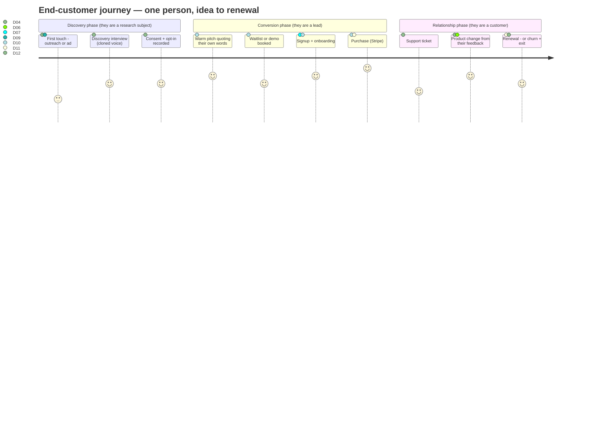
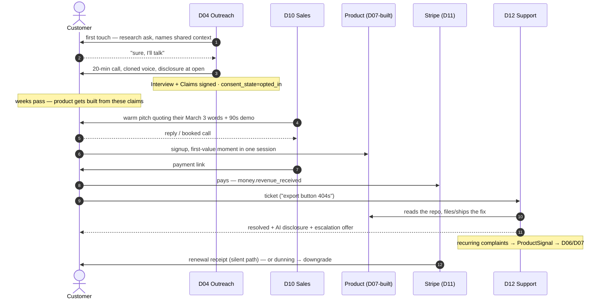

# 03 — The Customer Journey

The journey of the *venture's* end customer — the real human who gets an email from a company run
by agents, takes a call with a cloned voice, signs up, pays, complains, and renews or leaves.
Every founder-side file describes who approves an action; this file describes who *receives* it,
which department owns each step, which artifacts are produced, and which consent rules apply.

One framing rule from the north star: **believability over breadth.** A customer who goes first
touch → interview → warm pitch → paying → supported, end to end, is the demo. This file is that
person's biography.

---

## 1. The journey at a glance



Two distinct populations flow through this journey, and the consent rules differ per lane:

| Lane | Who | Entry | Ends up as |
|---|---|---|---|
| **Warm** | Interviewees from validation (founder's network, Terac panels) | D04 outreach, consented | The highest-converting list on earth — they shaped the product |
| **Cold** | ICP-matched strangers from D09 list-building, or ad respondents | First-touch email/DM/ad | Standard funnel, stricter consent gates, ≤50/day |

Terac panelists are a special case of warm: they were *paid* to be interviewed, which makes them
research subjects under Terac's terms, **not** free sales leads — see §5.

---

## 2. Stage by stage

Each stage: trigger, owning department(s), artifacts written, gates crossed, and what the customer
actually experiences. Stage numbers are referenced by the consent matrix in §5.

### Stage 1 — First touch **MVP**

| | |
|---|---|
| Trigger | D08's `GTMPlan` channel bets activate; D09 delivers scored `Lead[]` |
| Departments | D09 (list + compliance), D10 (send), D04 (if the touch is a research ask, not a pitch) |
| Artifacts | `Lead` (source, ICP fit, consent state, warm/cold provenance), `sales.sequence_started` events |
| Gates | `outbound_to_real_person` — warm auto-approves at `supervised`+; cold ≤50/day at `autonomous` only; `public_content` for anything published (ads, listings) |

What the customer sees: one email or Linq/SMS message that is specific to them. House rule,
enforced by the D10 critic: **every cold first-touch names the trigger event that put them on the
list** ("saw you're hiring your third biller") and every warm first-touch quotes *their own words*
from the interview. Generic spray is a defect, not a style choice.

What the customer never sees: a second message after silence sooner than 4 days, a third ever
(sequence caps: 3 touches, then the lead goes dormant for 90 days), or any message after an
opt-out (§5).

### Stage 2 — Discovery interview **MVP**

| | |
|---|---|
| Trigger | Warm lane: D04 network mining or a Terac requisition. A cold reply saying "sure, I'll talk" |
| Departments | D04 |
| Artifacts | `Interview` (recording + transcript), `Claim[]` into the `ClaimLedger`, `human.consent_recorded` |
| Gates | `outbound_to_real_person` (voice) — requires disclosure script + jurisdiction-aware recording consent + DNC check, at every autonomy level |

The customer books via a calendar link, gets a reminder, and takes a 20-minute call with the
founder's ElevenLabs-cloned voice. **The call opens with disclosure**: this is an AI system
calling on behalf of [founder], the call is recorded with their consent, they can end it anytime.
Mom-Test-compliant questions (past behavior, not future intent). At the end, one explicit ask:
*"Can we contact you when we've built something based on this?"* — the answer is recorded as
`consent_state ∈ {opted_in, declined}` and is the single fact that determines whether they enter
Stage 4 warm.

### Stage 3 — Waitlist **MVP where the product ships one**

| | |
|---|---|
| Trigger | Product not yet live (pre-Scene-6), or capacity-gated launch |
| Departments | D07 (the waitlist page is part of the deploy), D10 (nurture) |
| Artifacts | `Lead.consent_state='opted_in'` upgrade, waitlist position |
| Gates | `public_content` for the page itself; waitlist nurture emails are opted-in, no gate |

The waitlist confirmation email states what they signed up for, expected timing, and a one-click
remove link. Nurture is at most one update email per week, only when something shipped.

### Stage 4 — The warm pitch **MVP — this is the demo's sales beat**

| | |
|---|---|
| Trigger | `build.deployed` + `GTMPlan` signed → D10 sequences the warm pool |
| Departments | D10, with D08's messaging matrix |
| Artifacts | `Deal` (stage, value, next action, interaction history), `sales.reply_received`, `sales.meeting_booked` |
| Gates | warm `outbound_to_real_person` (auto at `supervised`+); voice calls always carry the disclosure conditions |

The canonical message: *"You told me on March 3rd that approvals were your worst hour of the
week. We built that. Here's a 90-second demo."* Channels: email, Linq iMessage rich card (a demo
card with a book-a-call button), or a booked voice call. Objections are logged verbatim to
`sales.*` events and flow back to D08's objection matrix — the customer improves the pitch for
the next customer whether or not they buy.

### Stage 5 — Signup & onboarding **MVP**

| | |
|---|---|
| Trigger | Customer clicks through to the deployed product |
| Departments | D07 (product + onboarding flow), D10 (assist), D12 (watches from day 0) |
| Artifacts | product-side account; `support.signal_filed` if onboarding friction is observed |
| Gates | none — the customer is acting, not the company |

The product's own signup, built by D07 to the `ProductSpec`. Requirements the D07 QA rubric
enforces on every venture: signup works without a sales conversation, a first-value moment is
reachable in one session (Replay-recorded as a QA scenario), and the privacy policy + ToS pages
exist and state that the service is operated with AI systems.

### Stage 6 — Purchase **MVP — `revenue_real`**

| | |
|---|---|
| Trigger | Deal reaches `commit`, or self-serve checkout |
| Departments | D10 (link), D11 (ledger, reconciliation), rail per venture geography: Stripe primary, Whop for consumer/community, Dodo as merchant-of-record fallback |
| Artifacts | `Order` (deal + Stripe object), `money.revenue_received`, updated `Ledger` and runway |
| Gates | none for the charge itself (the customer pays; money-in is not `money_out`). Refund path is gated later |

The customer gets: a Stripe-hosted checkout or payment link, a receipt from the rail, and a
welcome email (template pre-approved as `public_content` once per venture, then reused — the
per-send gate is only for *novel* copy). Test-mode charges are labeled test-mode everywhere,
including the customer-facing receipt page of the demo venture. Never fake a real charge.

### Stage 7 — Support **MVP**

| | |
|---|---|
| Trigger | Inbound email to the support address, in-app report, or a Stripe dispute webhook |
| Departments | D12; D07 for fixes; D11 for refunds |
| Artifacts | `Ticket`, `ProductSignal` for recurring complaints, `support.ticket_resolved` |
| Gates | `refund` (≤$50 first refund auto at `supervised`+); `outbound_to_real_person` does **not** apply — replying to an inbound ticket is responsive, not outreach |

D12 has repo access — it can read the bug. First response target: 1 hour (agent time is cheap;
the SLA is a config, not a promise made to the customer unless the venture's ToS makes it).
Every support reply discloses AI operation on first contact per thread and offers escalation.
The escalation path for a customer the agents cannot satisfy: D12 files
`Escalation(needs_human)`, which climbs the ladder — reaching the founder at rung 4 or a Terac
support specialist at rung 5. **The customer never sees the ladder**, only a reply that a person
will follow up, and then a person does.

### Stage 8 — Renewal, churn, and exit **POST-MVP except the events**

| | |
|---|---|
| Trigger | Subscription renewal date, a cancellation click, a dunning failure |
| Departments | D11 (dunning, revenue recognition), D12 (save motion), D10 (win-back, consent-gated) |
| Artifacts | `money.refunded` / renewal events, churn reason on the `Ticket` or exit survey, `ProductSignal` |
| Gates | `refund` if applicable; win-back outreach is `outbound_to_real_person` again — churned ≠ opted out, but a cancellation with "stop contacting me" sets `dnc` |

Renewal is silent when it works. Dunning: two receipts-style emails, then one Linq/SMS if the
customer opted into that channel, then downgrade — never collections. Cancellation is one click,
effective at period end, with an optional one-question exit survey. The save motion is one offer
maximum (the D12 critic rejects a second). On exit the customer gets: confirmation, a data-export
link where the product stores their data, and a statement of what is deleted when.

---

## 3. The full journey as a sequence



---

## 4. Departments × stages matrix

Who owns, who assists, what artifact each stage writes. `—` means the department does not touch
the customer at that stage (and its agents have no tool that could).

| Stage | D04 | D09 | D10 | D07 | D11 | D12 | Primary artifact |
|---|---|---|---|---|---|---|---|
| 1 First touch | owns (research asks) | builds/consents list | owns (pitches) | — | — | — | `Lead`, sequence events |
| 2 Interview | **owns** | — | — | — | pays Terac panelists | — | `Interview`, `Claim[]` |
| 3 Waitlist | — | — | nurtures | ships the page | — | — | `Lead` upgrade |
| 4 Warm pitch | supplies quotes | — | **owns** | — | — | — | `Deal` |
| 5 Signup | — | — | assists | **owns** | — | watches | product account |
| 6 Purchase | — | — | closes | — | **owns ledger** | — | `Order` |
| 7 Support | — | — | — | fixes | refunds | **owns** | `Ticket`, `ProductSignal` |
| 8 Renewal/churn | — | — | win-back | — | **owns** | save motion | churn events |

The matrix is also the enforcement map: per
[`../00-START-HERE/03-org-chart.md`](../00-START-HERE/03-org-chart.md), only D04, D10, and D12
may send email/iMessage to a real person, only D04 and D10 may place voice calls, and D09 drafts
but never sends. A department outside its column is a tool-allowlist violation, not a judgment
call.

---

## 5. Consent & opt-out rules — the matrix **MVP, enforced**

`Lead.consent_state` is the single source of truth, per channel where channels differ. States:

```
none ──► contacted ──► opted_in          any state ──► opted_out (sticky)
  │                        │             any state ──► dnc       (sticky, list-enforced)
  └── (cold cap applies) ──┘             declined: opted_in never granted; no re-ask 90d
```

| Action | Requires | Blocked by | Notes |
|---|---|---|---|
| Cold first-touch email/DM | compliance checks green, ≤50/day/venture, `autonomous` (else ASK) | `opted_out`, `dnc`, jurisdiction rules | Trigger-event relevance required by D10 critic |
| Cold voice call | all of the above + disclosure script + recording-consent path for the jurisdiction + number not on DNC | same | Always AUTO* at best — conditions, never blanket |
| Warm outreach (interviewed + opted in) | `consent_state='opted_in'` | `opted_out`, `dnc` | Auto at `supervised`+ |
| Research → sales lane change | the Stage-2 explicit ask answered yes | a `declined` at Stage 2 | Being interviewed is not sales consent by itself |
| Terac panelist → lead | **separate explicit opt-in during the paid session** | Terac ToS, `declined` | Paid research subjects are not a free lead list; see §5 and the open question below |
| Support reply | an inbound message from them | nothing — responsive | Not outreach; no gate |
| Win-back after churn | prior `opted_in`, cancellation without "stop contacting" | `dnc` set at cancellation | One sequence max, 30+ days after exit |
| Ad targeting (**POST-MVP**) | platform consent frameworks | — | No custom audiences from interview data, ever |

Opt-out mechanics, all lanes: every email has one-click unsubscribe; `STOP` on SMS/Linq and "take
me off your list" free-text both parse to `opted_out` + `human.dnc_added` (a Pioneer classifier
flags candidates; the deterministic keywords are authoritative). Opt-out propagates to every
channel for that person within one tick — email opt-out suppresses voice calls too, because the
customer opted out of *the company*, not of a channel. `dnc` and `opted_out` are sticky: no
agent, gate, or founder override un-sets them except the customer themselves asking in writing.

Suppression is visible: every outbound gate card shows `Suppressed: N` so the founder sees the
rules working ([template T3](02-founder-messaging-flows.md)).

---

## 6. What the customer is told about the machine

Disclosure is a product surface, not fine print. The rules, per touchpoint:

| Touchpoint | Disclosure |
|---|---|
| Voice call | Spoken at call open: AI system, on whose behalf, recorded, can hang up. Non-skippable, before any question |
| Email/DM | Signature block: operated by an AI system for [venture]; reply "human" to reach one |
| Product | ToS/privacy pages state AI operation; support pages repeat it |
| Support thread | First reply per thread restates it and offers human escalation |
| "human" replies | Route to the same `Escalation(needs_human)` path as an unsatisfiable ticket — rung 4 founder or rung 5 Terac human |

The bet, same as the kill switch's honesty about in-flight effects: disclosure costs a few
percentage points of response rate and buys the entire story's defensibility. A judge — or a
journalist — asking "did the nurse know she was talking to an AI?" must always have the answer
yes, with the consent event to prove it.

---

## 7. Evidence flowing back — the customer as a source

Every stage writes evidence that upstream departments consume. The customer is not just a revenue
source; they are the venture's highest-grade `evidence_class='real'` source, and the artifacts
say so:

```
Stage 2 Claims ────────────► ClaimLedger ──► D06 pivots (their quote moves the spec)
Stage 4 objections ────────► D08 objection matrix (next pitch is sharper)
Stage 5 onboarding friction ► ProductSignal ──► D07 backlog
Stage 7 recurring tickets ──► ProductSignal ──► D06/D07 (recurrence count attached)
Stage 8 churn reasons ──────► D08 positioning + D13 capability review
```

Rules: quotes carry speaker + timestamp and survive verbatim into pivot cards; a
`SyntheticPanelResult` never overrides a contradicting real-customer signal without the
disagreement being reported (invariant 7: synthetic ≠ proof); and none of this feedback data is
used for outreach targeting beyond the consent the customer granted — feedback is evidence, not
a marketing asset.

---

## 8. Demo notes — which stages are on screen

The 4-minute demo ([`../00-START-HERE/04-demo-and-judging.md`](../00-START-HERE/04-demo-and-judging.md))
shows this journey compressed to one seeded customer:

| Demo beat | Stage here | What's real vs seeded |
|---|---|---|
| 1:25 — recorded discovery call plays | Stage 2 | Real pre-run call, real consent event in the log |
| 2:55 — "You told me on March 3rd…" email | Stage 4 | Live send to a consenting plant/judge, quote pulled from the real `ClaimLedger` |
| 2:55 — payment link → live Stripe charge | Stage 6 | Live, test-mode, labeled test-mode on screen |
| (fallback `?replay=demo-1`) | Stages 1–7 | Full pre-run venture; every artifact carries its real timestamps |

Stages 3, 5, 7, 8 are demonstrable in the Boardroom's artifact browser but not narrated — the
evidence drawer answering "did she know it was an AI?" (the `human.consent_recorded` event) is
the pre-staged answer to the likely judge attack.

---

## Assumptions & open questions

- **Assumption:** the venture's end customer is contactable over email/SMS/voice — B2B or
  prosumer B2C. A venture whose customers are reachable only inside a marketplace (e.g. pure
  Whop distribution) skips Stages 1–4 and enters at Stage 5; the consent matrix still applies to
  any off-platform contact.
- **Assumption:** sequence caps (3 touches, 4-day spacing, 90-day dormancy) and the one-offer
  save motion are house policy, invented here as defaults. They belong in a
  `packages/contracts` policy object so D13 can tune them per venture with evidence — not
  hardcoded and not per-prompt.
- **Assumption:** support first-response target of 1 hour is a config default, not a
  customer-facing SLA unless the venture's ToS states one.
- **Open:** Terac panelist → lead conversion. Current position: requires a separate explicit
  opt-in *during* the paid session, and Terac's ToS may forbid it entirely. Needs a read of
  Terac's actual terms; until then D09 treats panelists as `dnc`-equivalent for sales.
  Conservative default, **MVP**.
- **Open:** jurisdiction matrix for recording consent (one-party vs two-party states, GDPR
  territories). The safety/compliance file should own the table; this file only asserts that the
  voice-call gate condition reads it. If it doesn't exist by build time, the fallback is
  two-party-consent behavior everywhere (announce + ask), which is legal everywhere and costs
  only awkwardness.
- **Open:** does the demo venture need Stage 8 at all? Renewal/churn cannot occur inside a
  4-minute demo or a 1-day hackathon. Events and schemas: **MVP** (they cost nothing). Dunning,
  win-back, exit surveys: **POST-MVP**, first real venture.
- **Open:** where does the customer's product data live for the export/deletion promise in
  Stage 8? That's a D07 build-rubric item per venture; this file can only require that the
  promise exists.
- **Open:** should "reply human" (§6) bypass the ladder's lower rungs entirely and go straight
  to rung 4/5? Current position: yes — a customer explicitly asking for a human is a
  `needs_human` escalation by definition, and making them wait through re-plans reads as evasion.
