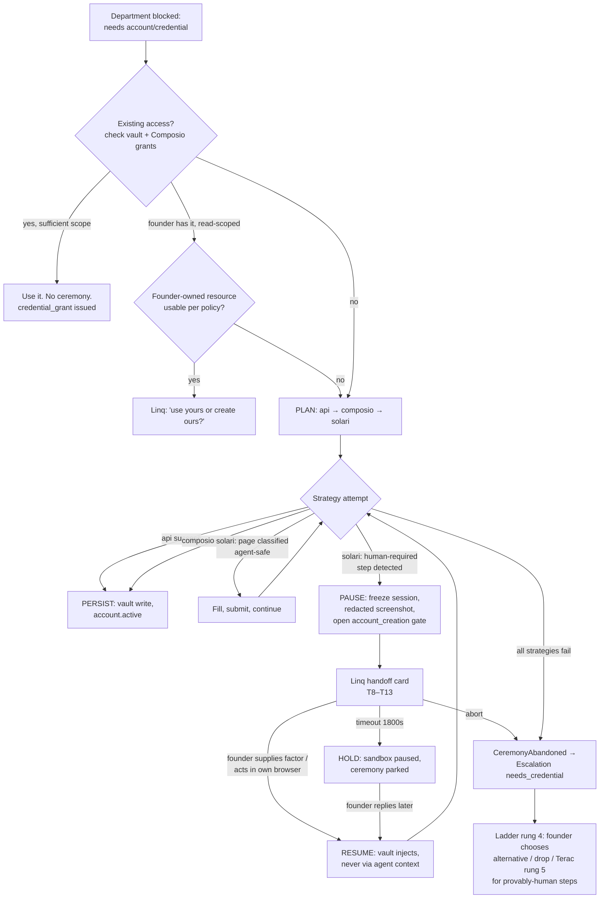

# 05 — The Account Ceremony, End to End

The exact workflow when the company needs an account or credential it cannot obtain alone. The
protocol and vault mechanics live in
[`../01-platform/07-identity-and-accounts.md`](../01-platform/07-identity-and-accounts.md); this
file is the *journey*: detection, classification, the founder handoff, resumption, timeout,
retry, and the audit trail — plus the decision table of what the system does alone versus what
always requires the founder, and how it checks the founder's **existing** access before asking
for anything new.

The one-line philosophy: **the ceremony is a relay race, not a request queue.** The company runs
every leg it legally and technically can, and hands the founder the baton for exactly one step —
pre-positioned, mid-stride, with the finish line visible.

---

## 0. The whole ceremony as one flow



Every box below gets a section. The gray path on the left (`B`) is the part most specs forget
and this file makes first-class: **ask the vault before you ask the founder.**

---

## 1. Detection — how a blocked need is noticed **MVP**

Three detection sites, in order of frequency:

| Site | Signal | Example |
|---|---|---|
| **Tool plane, pre-flight** | A tool call requires a credential the vault has no grant for | D09 calls `apify.run_actor`; no Apify credential exists for this venture |
| **Solari driver, mid-flight** | The page classifier hits a human-required step during a browser flow | GitHub org signup reaches "we sent a code to your phone" |
| **Planned prerequisite** | A routing rule or department plan names an account before work starts | D07's plan requires the GitHub org before its first commit; identity service pre-runs the ceremony |

The Solari classifier is **conservative by design** — the full signal table is in
[`07-identity-and-accounts.md`](../01-platform/07-identity-and-accounts.md): anything scoring
< 0.8 confidence is treated as human-required and pauses with a screenshot rather than clicking.
A wrong pause costs the founder ten seconds; a wrong click can cost an account lockout or a ToS
violation. The asymmetry decides the threshold.

Detection emits `identity.ceremony_opened` (or `ceremony_paused` mid-flight) with the requesting
department, provider, and *why* — the same `why` string later shown on the founder's card, so
the justification is authored once, at the point of need.

## 2. Check existing access before asking **MVP**

Before any ceremony — and before any "sign up for X" plan is even costed — the identity service
answers four questions, in order, stopping at the first yes:

| # | Question | Checked against | If yes |
|---|---|---|---|
| 1 | Does the **venture** already have this credential? | vault, `venture_id`-scoped | Issue a scoped `credential_grant`. No ceremony, no message |
| 2 | Does another account already cover the capability? | account inventory (e.g. GitHub org covers repo hosting; no GitLab needed) | Re-plan the tool call against the existing account |
| 3 | Does the **founder** have connected access with usable scope — including existing credits/plans? | Composio grants from onboarding; a read-only capability probe (e.g. Apify: `GET /users/me` shows a plan with credits remaining) | §2a — offer the choice; never silently spend the founder's resources |
| 4 | Is there a free-tier route that avoids the paid/human step entirely? | provider metadata in `packages/manifests/providers.yaml` | Prefer it; the paid route becomes the fallback |

### 2a — Using founder-authorized access

The rule from [`07-identity-and-accounts.md`](../01-platform/07-identity-and-accounts.md) holds:
the founder's own tokens are **read-scoped and never used for outbound**. Within that rule there
is real value to harvest — checking whether the founder already has credits on a tool before
buying a duplicate subscription is exactly the diligence a human cofounder would do:

| Founder resource | Company may, without asking | Requires the choice card | Never |
|---|---|---|---|
| Connected Gmail/LinkedIn/Calendar | Read for network mining (granted at onboarding) | — | Send from the founder's identity |
| A tool account with remaining credits (Apify, an enrichment API) | Detect the credits via read-only probe | Consume them: *"You have 4,200 Apify credits. Use ~300 of yours, or create a company account ($5/mo)?"* | Assume consent because OAuth exists |
| The founder's GitHub | Read repos supplied as intake material | Fork/import into the company org | Push to the founder's repos |
| The founder's payment methods | Nothing — the vault never holds them | — | Everything |

The choice card is a `money_out`-family decision even when using the founder's credits costs $0
cash, because it spends a founder-owned asset. `on_timeout='auto_reject'` → the company falls
back to creating its own account through the normal ceremony. One card, both options costed,
recommendation pre-selected — never a silent draw-down.

## 3. Classification of the blocker **MVP**

When a ceremony does pause, the step is classified into exactly one of seven kinds — this list
is closed, mirroring the detection table in
[`07-identity-and-accounts.md`](../01-platform/07-identity-and-accounts.md), and each maps to
one message template in [`02-founder-messaging-flows.md`](02-founder-messaging-flows.md):

| `HumanStep.kind` | Template | Founder effort | Where the secret goes |
|---|---|---|---|
| `2fa_code` | T8 | reply with digits | Vault → Solari session. Never agent context, never events, never logs |
| `captcha` | T9 | solve in the live session view | No secret; a human act |
| `phone_verification` | T10 | confirm/supply a number | Normal payload (PII, not secret) |
| `payment_method` | T11 | enter card in own browser | Provider only. Company never sees it |
| `id_check` | T12 | KYC in own browser | Provider only |
| `tos_acceptance` | T13 | read + accept | No secret; a legal act |
| `unknown` (< 0.8 confidence) | T9-shaped generic card with screenshot | look + advise | Depends on what it turns out to be |

## 4. The founder handoff **MVP**

One Linq card per pause, built from the ceremony state — provider, step kind, redacted
screenshot, the department's `why`, and the abort button. Card anatomy and reply grammars are
specified per-template in [`02-founder-messaging-flows.md` §2](02-founder-messaging-flows.md);
the ceremony-side requirements are:

- **The screenshot is redacted before send** — form values blanked, URLs stripped of tokens.
- **The ask is singular.** One step per card. If the flow will predictably need three founder
  steps (phone → OTP → ToS), the card says so up front ("step 1 of ~3") but still asks them one
  at a time — batching secrets into one message is how secrets end up in the wrong field.
- **The founder is never asked for a password.** The company generates account passwords itself,
  vault-side; the founder supplies only one-time factors and in-browser acts. Stated in
  [`07-identity-and-accounts.md`](../01-platform/07-identity-and-accounts.md), repeated here
  because every new provider integration will be tempted to violate it.
- Urgency: `2fa_code` and `captcha` ring through quiet hours only when founder-initiated or
  blocking a `risk='high'` chain; everything else defers. OTP expiry is handled by re-request,
  not by waking the founder (§6).

## 5. Resumption protocol **MVP**

```
founder reply arrives (Linq)
  │ parse (per-template grammar; OTP branch is deterministic regex + awaitingOtp)
  ▼
gate decision recorded ── secret? ──► vault, sealed channel ──► injected into the
  │                                       live Solari session (identity.resume_ceremony)
  ▼                                                 │
sandbox un-paused (Superserve resume, state intact) │
  ▼                                                 ▼
Solari re-classifies the CURRENT page ◄─────────────┘
  │
  ├─ classifier: proceed → ceremony continues from the exact field it stopped at
  ├─ classifier: another human step → new pause, new card ("step 2 of ~3")
  └─ classifier: flow reset/expired by provider → retry policy (§6), from the top,
     with everything already-supplied replayed from ceremony state (never re-asking
     the founder for a factor the provider didn't re-request)
```

Resumption is **stateless for the founder** — they never need to remember context. Hours later,
"done" or six digits is enough, because the frozen Solari session *is* the state, and the paused
sandbox bills at 10% while it waits. For `payment_method` / `id_check` steps where the founder
acted in their own browser, resumption verifies the outcome (a payment method now exists, KYC
status via API or page re-read) rather than trusting the "done."

## 6. Timeout and retry **MVP**

Two clocks run during any pause, and they are different things:

| Clock | Duration | On expiry |
|---|---|---|
| **Gate timeout** | 1800s prod / 30s demo, paused during quiet hours | `hold` — ceremony parks, sandbox pauses, department goes `blocked` (amber room). Founder's reply *whenever it comes* resumes it. A parked ceremony appears in the daily digest's "waiting on you" line |
| **Provider-side expiry** (OTP validity, session cookie, signup-flow TTL) | provider's, unknown to us precisely | On resume, the re-classify step catches it: expired OTP → tap the provider's "resend code" once, then re-card the founder as attempt 2; expired session → retry from the top per below |

Retry policy, ceremony-level:

| Failure | Retries | Backoff | Then |
|---|---|---|---|
| Strategy failed (API error, Composio connector down) | falls through to next strategy, no retry within strategy | — | next strategy in `[api, composio, solari]` |
| Solari flow reset by provider | 2 full-flow retries | 60s, 10m | classify as hostile provider → Escalation |
| Provider rejects the supplied factor (wrong OTP) | 1 re-ask of the founder ("that code didn't take — resent, try again") | immediate | abort ceremony, Escalation |
| Founder aborts | 0 | — | `CeremonyAbandoned` → Escalation `needs_credential` with the founder's abort as context — the ladder will not re-ask; rung 4 was effectively just answered |
| Rate-limited / suspected bot flag | 0 retries same day | 24h | Escalation, flagged `hostile_provider: true` so D13 sees the pattern |

An abandoned or failed ceremony **degrades, never fabricates**: the requesting department
receives the Escalation resolution, records `gaps[]` ("no Apify account: lead list built from
free sources only, ~40% smaller"), and ships partial. Ceremony failure is never a venture
failure.

## 7. The decision table — alone vs founder **MVP, enforced**

The consolidated answer to "what may the system do without me?" Rows marked *enforced* are tool
plane checks and tests, not guidance
([prohibited actions](../01-platform/07-identity-and-accounts.md)).

| Action | Alone? | Condition / note |
|---|---|---|
| Probe vault + Composio grants for existing access | **Always alone** | Read-only, logged |
| Read-only capability probe on a founder-connected tool | **Always alone** | The probe; not the spend |
| Create account via API/OAuth, free, no payment method | Alone at every autonomy level | `account_creation` AUTO row |
| Create account via browser ceremony, free | Alone at `supervised`+ (no payment method); ASK at `copilot` | Autonomy table |
| Generate + vault a password for a company account | **Always alone** | Founder never sees or supplies passwords |
| Receive verification email at the company mailbox, click link | **Always alone** | Root-of-trust mailbox must already exist |
| Fill signup forms with company identity (name, mailbox, address) | Alone (Solari, classifier-gated per page) | Conservative pause on <0.8 |
| Accept a provider's ToS | **Never alone** — T13 card | *Enforced*: no gate, no checkbox |
| Enter a payment method | **Never** — founder in own browser | *Enforced*: `payment.enter_card_details` prohibited |
| Solve/outsource CAPTCHA | **Never** | *Enforced*: `captcha.solve`, `captcha.outsource` prohibited |
| Supply an OTP/2FA factor | **Never alone** — founder relay, vault-injected | No agent can invent a credential (ladder skip rule) |
| ID/KYC documents, SSN/EIN, selfie | **Never** — founder only | *Enforced*: `identity.upload_government_id` prohibited |
| Consume founder credits / founder-owned assets | **Never silently** — choice card (§2a) | `money_out`-family even at $0 cash |
| Send outbound from the founder's personal accounts | **Never** | Founder tokens read-scoped, *enforced* |
| Create an account impersonating a person | **Never** | *Enforced*: `account.create_as_person` prohibited |
| Paid account signup | Never alone: `account_creation` + `money_out`, ASK at all levels for the account itself | Autonomy table (paid row) |
| Hire a Terac human to do a ceremony step | **Never** for credential steps (they're founder-personal); allowed for provider-side human tasks (e.g. a notarized form the *provider* requires) with `money_out` gate | Rung-5 skip rule applies |

## 8. Audit trail **MVP**

Ceremony states, for reference — each transition is an `identity.*` event and each maps onto the
flow in §0:

| State | Meaning | Terminal |
|---|---|---|
| `planning` | §2 existing-access checks + strategy ordering | no |
| `attempting` | A strategy (`api`/`composio`/`solari`) is running | no |
| `paused_for_human` | A `HumanStep` blocked it; gate open, session frozen, sandbox paused | no |
| `resuming` | Founder responded; secret injected / outcome verified; re-classifying | no |
| `completed` | Credential vaulted, account `active`, grants issued | yes |
| `abandoned` | Founder aborted, or the last strategy failed → Escalation `needs_credential` | yes |
| `superseded` | The need disappeared (work order cancelled, kill switch) | yes |

Every ceremony is reconstructable to the same standard as a gate
([`06-human-in-the-loop.md` Part 9](../01-platform/06-human-in-the-loop.md)) — who asked, why,
what the founder did, what was created, what it can now touch:

```sql
SELECT c.id, c.provider, c.requested_by_dept, c.why, c.strategy_used,
       c.status, c.opened_at, c.closed_at,
       p.step_kind, p.paused_at, p.resumed_at,
       (p.resumed_at - p.paused_at)        AS founder_latency,
       g.decided_by, g.status              AS gate_status,
       a.id AS account_id, a.scopes,
       cg.department_id                    AS granted_to, cg.expires_at
FROM ceremonies c
LEFT JOIN ceremony_pauses  p  ON p.ceremony_id = c.id
LEFT JOIN gates            g  ON g.id = p.gate_id
LEFT JOIN accounts         a  ON a.id = c.account_id
LEFT JOIN credential_grants cg ON cg.account_id = a.id
WHERE c.venture_id = $1 ORDER BY c.opened_at, p.paused_at;
```

What the trail contains, and pointedly does not:

| Recorded | Never recorded |
|---|---|
| `identity.ceremony_opened/paused/resumed/completed/abandoned` events with step kinds and timings | The OTP value — event says `{step:'2fa_code', supplied:true}` and nothing else |
| Redacted screenshots (as pause evidence, object-stored) | Unredacted screenshots, form values |
| The `why` string, the strategy sequence tried, per-strategy failures | Passwords, in any form, anywhere outside the vault ciphertext |
| Gate decisions with `decided_by` and latency | Payment/ID data — it never entered the system |
| Resulting account, scopes, and every `credential_grant` issued against it | Raw secrets in `events`, `artifacts`, `memory_chunks`, logs (redaction filter on every write path) |

The demo answer this buys: a judge asks *"so it has a GitHub account — who approved that, and
what can it do with it?"* — one query, one screen: requested by D07 at 14:01, founder supplied
the 2FA at 14:03 (42s latency), org `zeroth-dental`, grants scoped to D07 and D13, expiring with
the venture.

---

## 9. Two special-case ceremonies

### 9a — The mailbox: root of trust **MVP**

The company mailbox is ceremony zero, run at venture creation, before any department needs
anything — because every other signup's verification email lands there
([root-of-trust ordering](../01-platform/07-identity-and-accounts.md)). Two consequences unique
to it:

- **No fallback past it.** If the mailbox ceremony fails or is abandoned, the identity service
  refuses to start any downstream ceremony rather than scattering half-built accounts. The
  founder's card for a failed mailbox says exactly that: nothing else proceeds until this does.
- **The delegation shortcut.** The founder may instead supply a forwarding alias on a domain
  they own ("use ideas@myco.com"). This is founder-authorized access per §2a — a choice card,
  and the alias is verified by round-trip before it becomes root of trust.

### 9b — Stripe: the ceremony that stays open for days **MVP for charges, KYC path unavoidable**

Stripe splits into two independently-useful halves, and the ceremony treats them as two
milestones so the venture is never blocked on the slow one:

| Milestone | Blocked on | Unblocks |
|---|---|---|
| Charges work (test or restricted-live) | API-route account creation + founder email confirm | The demo, `revenue_real`, the whole sales motion |
| Payouts work | T12 KYC — founder identity, in their own browser, plus Stripe's review (hours–days) | Money reaching the founder's bank |

The ceremony marks the account `active(restricted)` after milestone 1, files the KYC pause as a
long-hold (`on_timeout='hold'`, daily webhook/API re-check, digest line until resolved), and
never lets a department treat "payouts pending" as "payments broken."

---

## 10. Worked example — the GitHub org, end to end **MVP**

The canonical ceremony, annotated with timings from the demo seed. D07 needs a repo home before
its first commit.

| t | Actor | What happens | Events |
|---|---|---|---|
| 0:00 | D07 head | Plan names `github_org` as a prerequisite; identity service invoked | `identity.ceremony_opened` |
| 0:01 | Identity | §2 checks: vault → none. Inventory → none. Founder GitHub connected, read-scoped → policy says company org, not founder account (decision table: never push to founder repos). Free route exists | — |
| 0:02 | Identity | Strategy `api`: create org under the company's GitHub account… which requires the company GitHub *user* to exist first → nested ceremony, `solari` strategy | — |
| 0:04 | Solari | Signup form: company mailbox, generated vault password, display name. Classifier: agent-safe, fills | — |
| 0:35 | Solari | "Verify your email" → identity service reads the link from the company mailbox, clicks. Still alone | — |
| 1:10 | Solari | "We sent a code to your phone" → classified `2fa_code` | `identity.ceremony_paused` |
| 1:11 | Gateway | T8 card to founder: *"GitHub needs a 2FA code"* | `gate.opened` |
| 3:52 | Founder | Replies `481022`. OTP branch: digits + `awaitingOtp` → vault, sealed channel | `gate.approved` (`{supplied:true}`, no value) |
| 3:53 | Solari | Code injected into the live session; page re-classified: proceed | `identity.ceremony_resumed` |
| 4:20 | Identity | User exists → back up the nested stack → `POST /orgs` creates `zeroth-dental` via API | — |
| 4:22 | Identity | Vault write, account `active`, grants issued to D07 + D13 | `identity.ceremony_completed` |
| 4:23 | D07 | First `git push` lands. Total founder involvement: one reply, 42 seconds of latency, zero context needed | `build.repo_created` |

Everything about the protocol is visible in this one run: the existing-access check that chose
"company org" over "borrow the founder's," the nested ceremony, the conservative pause, the
secret path that never touched an agent, and the audit row that answers a judge in one query.

---

## Assumptions & open questions

- **Assumption:** `ceremonies`, `ceremony_pauses`, and `credential_grants` tables exist per the
  identity file's protocol; the SQL above names columns that
  [`04-data-model.md`](../01-platform/04-data-model.md) should confirm or this file should be
  corrected against. The event names `identity.*` extend the taxonomy in
  [`03-event-bus.md`](../01-platform/03-event-bus.md) — add the namespace row there.
- **Assumption:** read-only capability probes (§2, "does the founder have credits") are
  permitted by each provider's API terms under a read-scoped OAuth grant. True for Apify-shaped
  APIs; verify per provider in `providers.yaml` metadata.
- **Assumption:** Superserve pause keeps a live Solari browser session resumable for hours. If
  the *provider's* session cookie dies first, the retry path covers it — but if this is the
  common case, "hold overnight" quietly becomes "retry from the top every morning," which is
  worse UX than the spec implies. Measure with the real providers on the inventory list.
- **Open:** the "step 1 of ~3" lookahead requires the classifier to predict a flow's remaining
  human steps. A static per-provider step map in `providers.yaml` (GitHub org: phone → OTP;
  Stripe: email → KYC) is cheap and right for the ~10 providers in the account inventory;
  generic prediction is **POST-MVP**. Recommend the static map, **MVP**.
- **Open:** §2a treats founder-credit consumption as `money_out`-family at $0 cash. Should it
  meter into the department's envelope at the provider's list-price equivalent so Treasury sees
  the true resource cost? Leaning yes (**POST-MVP**) — otherwise founder credits look free and
  get over-consumed.
- **Open:** hostile-provider handling (rate limits, bot flags) currently just escalates. Is
  there a legitimate Terac play — hire a human to complete a signup the provider requires a
  human for? §7 says yes for provider-side human tasks, but the boundary with "impersonating a
  person" needs one careful paragraph in the Terac integration file before anyone builds it.
- **Open:** multi-venture founders — when venture 2 needs a tool venture 1 already pays for,
  vault scoping (`venture_id`) correctly refuses sharing. The right move is probably a
  founder-choice card ("share the plan across ventures?") but billing attribution gets murky.
  **POST-MVP**, single-venture demo unaffected.
